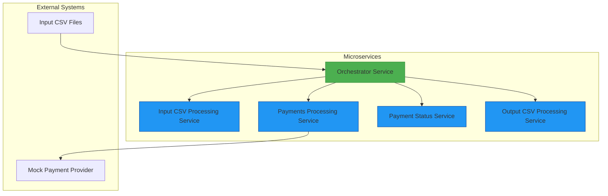
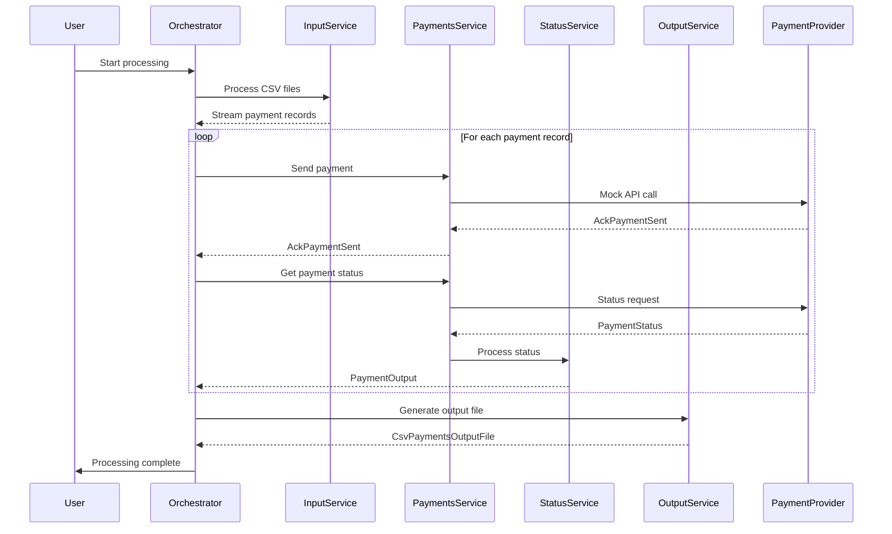

[](https://github.com/mbarcia/CSV-Payments-PoC/actions/workflows/tests.yaml)

# CSV Payments Processing Application

## Overview

The CSV Payments Processing Application is a Quarkus-based microservices system designed to process CSV files containing payment information. It reads payment records from input CSV files, sends them to a mock payment processor, retrieves their final statuses, and generates output CSV files with the processed results.

This application demonstrates modern microservices architecture patterns using gRPC for inter-service communication, reactive programming with Mutiny, and virtual threads for efficient concurrency. It simulates the complexities of real-world asynchronous payment processing systems.

## Key Features

- **Microservices Architecture**: Modular design with independently deployable services
- **Reactive Programming**: Non-blocking operations using Mutiny
- **gRPC Communication**: High-performance service-to-service communication
- **Virtual Threads**: Efficient concurrency with Project Loom
- **Rate Limiting Simulation**: Realistic throttling behavior
- **Retry Logic**: Automatic retries for transient failures
- **Parallel Processing**: Concurrent handling of multiple payment records
- **Comprehensive Logging**: Detailed observability and debugging information

## Architecture



## Repository Structure

This project consists of Maven submodules, each containing a microservice that runs independently:

- [**Orchestrator Service**](./orchestrator-svc/README.md): Main entry point that coordinates the entire workflow
- [**Input CSV File Processing Service**](./input-csv-file-processing-svc/README.md): Reads and parses input CSV files
- [**Payments Processing Service**](./payments-processing-svc/README.md): Interacts with the mock payment provider
- [**Payment Status Service**](./payment-status-svc/README.md): Processes payment statuses
- [**Output CSV File Processing Service**](./output-csv-file-processing-svc/README.md): Generates output CSV files
- [**Common Module**](./common/README.md): Shared domain models and utilities
- [**Data Persistence Service**](./data-persistence-svc/README.md): Handles data persistence (optional)

## Motivation

Write a command-line client to process CSV files containing payments.

Each line needs to be processed via a test provider which is an external API.

This is not as simple as just invoking a single API on the provider and returning the results because the provider processes payments asynchronously, and it is your job to print the ultimate status after processing.

### API Call Parameters

| Field     | M   | Type    | Description                                       |
|-----------|-----|---------|---------------------------------------------------|
| msisdn    | M   | string  | Recipient phone number.                           |
| amount    | M   | decimal | Amount to pay.                                    |
| currency  | M   | string  | ISO-4217 currency code of amount.                 |
| reference | O   | string  | Client-supplied identifier for this payment.      |
| url       | O   | string  | URL to send callback request with payment result. |

### API Response

| Field          | M   | Type    | Description                              |
|----------------|-----|---------|------------------------------------------|
| status         | M   | decimal | Status of request. See "Status" section. |
| message        | O   | string  | Additional information about the status. |
| conversationID | O   | string  | Identifier for this request.             |

### Processing Flow

1. Get a session token.
2. Request an action (payment, name lookup, etc.)
3. If the action is asynchronous, await callback requests from the provider.
   Callbacks may be enabled or disabled as needed.
4. If the action is asynchronous and callbacks are disabled or no callback was
   received in the expected amount of time, poll for results as needed.

### Expected CSV Output Columns

1. AMOUNT
2. CSV ID
3. CURRENCY
4. FEE
5. MESSAGE
6. RECIPIENT
7. REFERENCE
8. STATUS

## Data Flow

The CSV Payments Processing Application follows a complex end-to-end data flow that handles asynchronous payment processing:



### Detailed Processing Steps

1. **Input Processing**: The Orchestrator Service reads CSV payment input files from a specified folder using the Input CSV File Processing Service.

2. **Payment Record Extraction**: Each input file is processed, extracting individual payment records as a stream.

3. **Payment Sending**: Payment records are sent to the Payments Processing Service, which interacts with a mock payment provider.

4. **Acknowledgment Handling**: The application receives and processes immediate partial responses (AckPaymentSent) from the payment provider.

5. **Status Polling**: For each acknowledgment, the application polls the payment provider for the final payment status.

6. **Status Processing**: Final payment statuses are processed by the Payment Status Service to generate standardized output records.

7. **Output Generation**: The Output CSV File Processing Service generates CSV payment output files based on the processed payment records.

8. **Completion**: The Orchestrator Service coordinates the entire workflow and provides console output for debugging purposes.

## Technology Stack

- **Quarkus**: Kubernetes-native Java framework
- **gRPC**: High-performance RPC communication
- **Mutiny**: Reactive programming library
- **Virtual Threads**: Project Loom for efficient concurrency
- **Maven**: Build automation tool
- **JUnit 5**: Testing framework
- **Mockito**: Mocking framework
- **Lombok**: Boilerplate code reduction
- **MapStruct**: Java bean mappings
- **OpenCSV**: CSV processing library

## Getting Started

### Prerequisites

- Java 21
- Maven 3.6+
- Docker (optional, for containerized deployment)

### Installation

1. Clone the repository:
   ```bash
   git clone https://github.com/mbarcia/CSV-Payments-PoC.git
   ```

2. Navigate to the project directory:
   ```bash
   cd CSV-Payments-PoC
   ```

### Building the Application

```bash
mvn clean package
```

### Running the Application

#### Development Mode

To run the application in development mode with hot reloading:

```bash
mvn quarkus:dev
```

#### Running as JAR Files

Each service can be run as a standalone JAR:

```bash
java -jar orchestrator-svc/target/orchestrator-svc-0.0.1-SNAPSHOT.jar --csv-folder=/path/to/csv/files
```

#### Running in Native Mode

To build and run in native mode for better performance:

```bash
mvn clean package -Pnative
./orchestrator-svc/target/orchestrator-svc-0.0.1-SNAPSHOT-runner --csv-folder=/path/to/csv/files
```

### Configuration

The application uses environment variables for configuration:

- `CSV_FOLDER_PATH`: Path to the folder containing CSV files (default: "csv/")
- `PROCESS_CSV_PAYMENTS_INPUT_FILE_SVC_HOST`: Input service host (default: "localhost")
- `PROCESS_CSV_PAYMENTS_INPUT_FILE_SVC_PORT`: Input service port (default: 8081)
- `SEND_PAYMENT_RECORD_SVC_HOST`: Payments service host (default: "localhost")
- `SEND_PAYMENT_RECORD_SVC_PORT`: Payments service port (default: 8082)
- And more for each service...

See [application.properties](./orchestrator-svc/src/main/resources/application.properties) for complete configuration options.

### Testing

To run the tests, execute:

```bash
mvn test
```

To run tests with code coverage:

```bash
mvn clean test jacoco:report
```

## Troubleshooting

### Common Issues and Solutions

1. **Application fails to start**
   - Check if the Java version is correct (Java 21 required)
   - Ensure all dependencies are properly downloaded (run `mvn dependency:resolve`)
   - Verify the `application.properties` configurations
   - Check that all required services are running and accessible

2. **CSV files not being processed**
   - Confirm the correct folder path is provided as an argument
   - Check file permissions on the input folder
   - Verify CSV file format matches expected structure
   - Ensure CSV files have the `.csv` extension

3. **gRPC connection issues**
   - Verify that all microservices are running
   - Check that service ports are correctly configured
   - Ensure there are no firewall or network connectivity issues
   - Validate that service names in configuration match actual service names

4. **Performance issues**
   - Monitor CPU and memory usage during processing
   - Check if rate limiting is causing delays
   - Verify that virtual threads are being used effectively
   - Consider adjusting concurrency limits in the orchestrator

5. **Rate limiting errors**
   - The mock payment provider simulates rate limiting
   - The application includes retry logic for throttling errors
   - Adjust `payment.provider.permits-per-second` in configuration to change rate limits

### Logging and Debugging

The application provides comprehensive logging at different levels:

- INFO: General workflow information
- WARN: Non-critical issues that should be addressed
- ERROR: Critical failures that stop processing
- DEBUG: Detailed information for troubleshooting

To enable debug logging, set the log level in `application.properties`:

```properties
quarkus.log.level=DEBUG
```

### Performance Optimization

- Monitor CPU and memory usage during processing
- Consider increasing the parallel processing threads if hardware resources allow
- Profile the application using tools like VisualVM to identify bottlenecks
- Adjust the `CONCURRENCY_LIMIT_RECORDS` parameter in ProcessFileService for optimal throughput
- Tune the rate limiting parameters in the Payments Processing Service

### REST APIs

In addition to gRPC interfaces, some services expose REST APIs for easier integration:

- **Output CSV File Processing Service**: Exposes REST endpoints for processing payment outputs
  - `POST /api/v1/output-processing/process-file` - Process payment outputs to a file
  - `POST /api/v1/output-processing/process` - Process payment outputs stream

### Docker Deployment Issues

When running with Docker:

1. Ensure all services are on the same Docker network
2. Verify that volume mounts are correctly configured for CSV file access
3. Check that environment variables are properly passed to containers
4. Confirm that port mappings don't conflict with other services

## Related Services

- [Orchestrator Service](./orchestrator-svc/README.md): Main coordination service
- [Input CSV File Processing Service](./input-csv-file-processing-svc/README.md): Reads and parses input CSV files
- [Payments Processing Service](./payments-processing-svc/README.md): Interacts with the mock payment provider
- [Payment Status Service](./payment-status-svc/README.md): Processes payment statuses
- [Output CSV File Processing Service](./output-csv-file-processing-svc/README.md): Generates output CSV files
- [Common Module](./common/README.md): Shared domain models and utilities

## Contributing

1. Fork the repository
2. Create a feature branch
3. Commit your changes
4. Push to the branch
5. Create a pull request

## License

This project is licensed under the Apache License 2.0 - see the [LICENSE](LICENSE) file for details.