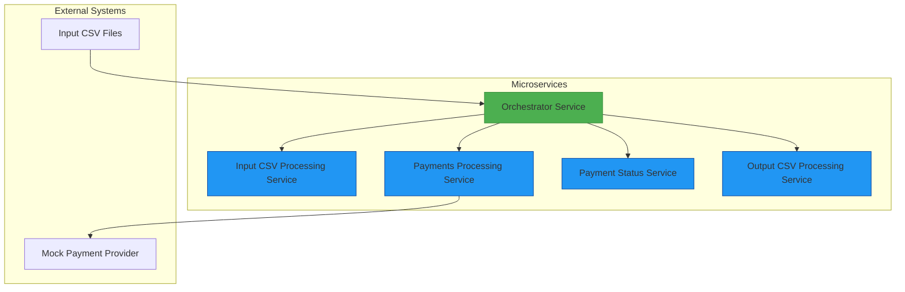
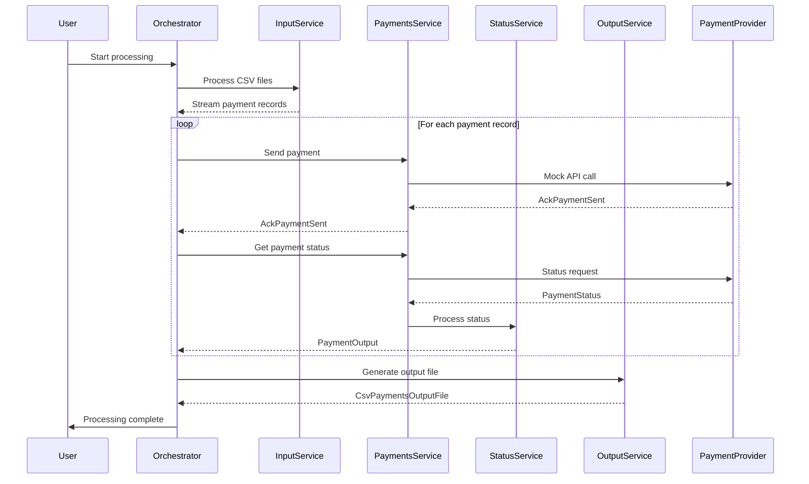

[](https://github.com/mbarcia/CSV-Payments-PoC/actions/workflows/tests.yaml)

# CSV Payments Processing Application

## Overview

The CSV Payments Processing Application is a Quarkus-based microservices system designed to process CSV files containing payment information. It reads payment records from input CSV files, sends them to a mock payment processor, retrieves their final statuses, and generates output CSV files with the processed results.

This application demonstrates modern microservices architecture patterns using gRPC for inter-service communication, reactive programming with Mutiny, and virtual threads for efficient concurrency. It simulates the complexities of real-world asynchronous payment processing systems.

## Key Features

- **Microservices Architecture**: Modular design with independently deployable services
- **Reactive Programming**: Non-blocking operations using Mutiny
- **gRPC Communication**: High-performance service-to-service communication
- **Virtual Threads**: Efficient concurrency with Project Loom
- **Rate Limiting Simulation**: Realistic throttling behavior
- **Retry Logic**: Automatic retries for transient failures
- **Parallel Processing**: Concurrent handling of multiple payment records
- **Comprehensive Logging**: Detailed observability and debugging information

## Architecture

### Pipeline Framework

This service is built using the pipeline framework which provides numerous benefits for distributed processing:

- [How to Create a New Pipeline Step](./pipeline-framework/docs/HOWTO_NEW_STEP.md) - Guide for implementing new steps
- [Pipeline Benefits](./pipeline-framework/docs/PIPELINE_BENEFITS.md) - Detailed list of advantages of using the framework

### Running End-to-End Tests

To run the end-to-end integration test that starts all services and processes a sample CSV file:

1. Ensure you have Java 21 and Maven installed
2. Navigate to the project root directory
3. Run the end-to-end test script:
   ```bash
   ./run-e2e-test.sh
   ```

This script will:
1. Start all required microservices
2. Wait for all services to become healthy by checking their health endpoints
3. Copy a sample CSV file to the test directory
4. Run the orchestrator to process the CSV file
5. Verify that output files are generated
6. Stop all services

The script uses the health endpoints (`/q/health`) of each service to determine when they are ready, rather than waiting a fixed amount of time.

### Port Configuration

The services use the following ports:
- input-csv-file-processing-svc: 8444
- payments-processing-svc: 8445
- payment-status-svc: 8446
- output-csv-file-processing-svc: 8447
- orchestrator-svc: 8443 (gRPC)

All services communicate over HTTPS with self-signed certificates.




## Repository Structure

This project consists of Maven submodules, each containing a microservice that runs independently:

- [**Orchestrator Service**](./orchestrator-svc/README.md): Main entry point that coordinates the entire workflow
- [**Input CSV File Processing Service**](./input-csv-file-processing-svc/README.md): Reads and parses input CSV files
- [**Payments Processing Service**](./payments-processing-svc/README.md): Interacts with the mock payment provider
- [**Payment Status Service**](./payment-status-svc/README.md): Processes payment statuses
- [**Output CSV File Processing Service**](./output-csv-file-processing-svc/README.md): Generates output CSV files
- [**Common Module**](./common/README.md): Shared domain models and utilities

## Motivation

Write a command-line client to process CSV files containing payments.

Each line needs to be processed via a test provider which is an external API.

This is not as simple as just invoking a single API on the provider and returning the results because the provider processes payments asynchronously, and it is your job to print the ultimate status after processing.

### API Call Parameters

| Field     | M   | Type    | Description                                       |
|-----------|-----|---------|---------------------------------------------------|
| msisdn    | M   | string  | Recipient phone number.                           |
| amount    | M   | decimal | Amount to pay.                                    |
| currency  | M   | string  | ISO-4217 currency code of amount.                 |
| reference | O   | string  | Client-supplied identifier for this payment.      |
| url       | O   | string  | URL to send callback request with payment result. |

### API Response

| Field          | M   | Type    | Description                              |
|----------------|-----|---------|------------------------------------------|
| status         | M   | decimal | Status of request. See "Status" section. |
| message        | O   | string  | Additional information about the status. |
| conversationID | O   | string  | Identifier for this request.             |

### Processing Flow

1. Get a session token.
2. Request an action (payment, name lookup, etc.)
3. If the action is asynchronous, await callback requests from the provider.
   Callbacks may be enabled or disabled as needed.
4. If the action is asynchronous and callbacks are disabled or no callback was
   received in the expected amount of time, poll for results as needed.

### Expected CSV Output Columns

1. AMOUNT
2. CSV ID
3. CURRENCY
4. FEE
5. MESSAGE
6. RECIPIENT
7. REFERENCE
8. STATUS

## Data Flow

The CSV Payments Processing Application follows a complex end-to-end data flow that handles asynchronous payment processing:



### Detailed Processing Steps

1. **Input Processing**: The Orchestrator Service reads CSV payment input files from a specified folder using the Input CSV File Processing Service.

2. **Payment Record Extraction**: Each input file is processed, extracting individual payment records as a stream.

3. **Payment Sending**: Payment records are sent to the Payments Processing Service, which interacts with a mock payment provider.

4. **Acknowledgment Handling**: The application receives and processes immediate partial responses (AckPaymentSent) from the payment provider.

5. **Status Polling**: For each acknowledgment, the application polls the payment provider for the final payment status.

6. **Status Processing**: Final payment statuses are processed by the Payment Status Service to generate standardized output records.

7. **Output Generation**: The Output CSV File Processing Service generates CSV payment output files based on the processed payment records.

8. **Completion**: The Orchestrator Service coordinates the entire workflow and provides console output for debugging purposes.

## Technology Stack

- **Quarkus**: Kubernetes-native Java framework
- **gRPC**: High-performance RPC communication
- **Mutiny**: Reactive programming library
- **Virtual Threads**: Project Loom for efficient concurrency
- **Maven**: Build automation tool
- **JUnit 5**: Testing framework
- **Mockito**: Mocking framework
- **Lombok**: Boilerplate code reduction
- **MapStruct**: Java bean mappings
- **OpenCSV**: CSV processing library

## Observability Stack

- **Micrometer**: Application metrics collection integrated with Quarkus
- **OpenTelemetry**: Distributed tracing and metrics collection
- **Prometheus**: Metrics storage and querying
- **Grafana**: Metrics visualization and dashboarding
- **Tempo**: Distributed tracing backend
- **Loki**: Log aggregation system

## Getting Started

### Prerequisites

- Java 21
- Maven 3.6+
- Docker (optional, for containerized deployment)

### Installation

1. Clone the repository:
   ```bash
   git clone https://github.com/mbarcia/CSV-Payments-PoC.git
   ```

2. Navigate to the project directory:
   ```bash
   cd CSV-Payments-PoC
   ```

### Building the Application

```bash
mvn clean package
```

### Running the Application

#### Development Mode

To run the application in development mode with hot reloading:

```bash
# Start the services (excluding orchestrator-svc which is a CLI application)
./up-local.sh

# Or, for more control, start services individually:
# In separate terminals, run:
# cd input-csv-file-processing-svc && mvn quarkus:dev
# cd payments-processing-svc && mvn quarkus:dev
# cd payment-status-svc && mvn quarkus:dev
# cd output-csv-file-processing-svc && mvn quarkus:dev

# Run the orchestrator-svc as a CLI application (after all services are up)
# In a separate terminal:
# cd orchestrator-svc && mvn quarkus:dev
#
# Stop the services
./down-local.sh
```

#### Running as JAR Files

Each service can be run as a standalone JAR:

```bash
# Start the services (excluding orchestrator-svc which is a CLI application)
# Build all services first
mvn clean package

# Start each service in a separate terminal
java -jar input-csv-file-processing-svc/target/input-csv-file-processing-svc-1.0.jar
java -jar payments-processing-svc/target/payments-processing-svc-1.0.jar
java -jar payment-status-svc/target/payment-status-svc-1.0.jar\njava -jar output-csv-file-processing-svc/target/output-csv-file-processing-svc-1.0.jar\n\n# Run the orchestrator-svc as a CLI application (after all services are up)
java -jar orchestrator-svc/target/orchestrator-svc-1.0.jar --csv-folder=/path/to/csv/files

# Note: You'll need to stop each service manually in each terminal
```

#### Running in Native Mode

To build and run in native mode for better performance:

```bash
# Build all services in native mode
mvn clean package -Pnative

# Start each service in a separate terminal
./input-csv-file-processing-svc/target/input-csv-file-processing-svc-1.0-runner
./payments-processing-svc/target/payments-processing-svc-1.0-runner
./payment-status-svc/target/payment-status-svc-1.0-runner\n./output-csv-file-processing-svc/target/output-csv-file-processing-svc-1.0-runner\n\n# Run the orchestrator-svc as a CLI application (after all services are up)
./orchestrator-svc/target/orchestrator-svc-1.0-runner --csv-folder=/path/to/csv/files

# Note: You'll need to stop each service manually in each terminal
```

### Configuration

The application uses environment variables for configuration:

- `CSV_FOLDER_PATH`: Path to the folder containing CSV files (default: "csv/")
- `PROCESS_CSV_PAYMENTS_INPUT_FILE_SVC_HOST`: Input service host (default: "localhost")
- `PROCESS_CSV_PAYMENTS_INPUT_FILE_SVC_PORT`: Input service port (default: 8081)
- `SEND_PAYMENT_RECORD_SVC_HOST`: Payments service host (default: "localhost")
- `SEND_PAYMENT_RECORD_SVC_PORT`: Payments service port (default: 8082)
- And more for each service...

See [application.properties](./orchestrator-svc/src/main/resources/application.properties) for complete configuration options.

For development with Dev Services, the following environment variables can be used:

- `ENABLE_DEV_SERVICES`: Enable or disable Dev Services for data-persistence-svc (default: true)
- `QUARKUS_DATASOURCE_DEVSERVICES_PORT`: Port to map the Dev Services database container to (default: randomly assigned)
- `QUARKUS_DATASOURCE_DEVSERVICES_IMAGE_NAME`: Docker image to use for the database (default: postgres:16)
- `QUARKUS_DATASOURCE_DEVSERVICES_DB_NAME`: Name of the database to create (default: quarkus)
- `QUARKUS_DATASOURCE_DEVSERVICES_USERNAME`: Username for the database (default: quarkus)
- `QUARKUS_DATASOURCE_DEVSERVICES_PASSWORD`: Password for the database (default: quarkus)

### Testing

To run the tests, execute:

```bash
mvn test
```

To run tests with code coverage:

```bash
mvn clean test jacoco:report
```

#### End-to-End Integration Testing

To run an end-to-end integration test that starts all services and processes a real CSV file:

```bash
./run-e2e-test.sh
```

This script will start all microservices, process a sample CSV file, and verify the results. See [pipeline-framework/docs/README.md](./pipeline-framework/docs/README.md) for more details.

## SSL Certificate Handling in Development

When running the services with HTTPS enabled, self-signed certificates are used for development purposes. To avoid browser security warnings, you need to add these certificates to your system's trusted certificate store.

### Trusting the Existing Certificate

The repository already includes a pre-generated certificate (`server-keystore.jks`) that you can trust:

1. **Add the existing certificate to your macOS keychain**:
   ```bash
   # Start one of the services first (e.g., in a separate terminal):
   # cd input-csv-file-processing-svc && mvn quarkus:dev

   # Export the certificate from the running service
   echo | openssl s_client -connect localhost:8444 2>/dev/null | openssl x509 > /tmp/quarkus-cert.pem

   # Add to user keychain
   security add-trusted-cert -d -r trustRoot -k ~/Library/Keychains/login.keychain-db ./kong/quarkus-cert.pem
 ```

2. **Restart your browser** to ensure it picks up the new trusted certificate.

3. **Restart all services**:
   ```bash
   # In separate terminals, start each service:
   # Terminal 1:
   cd input-csv-file-processing-svc && mvn quarkus:dev

   # Terminal 2:
   cd payments-processing-svc && mvn quarkus:dev

   # Terminal 3:
   cd payment-status-svc && mvn quarkus:dev

   # Terminal 4:
   cd output-csv-file-processing-svc && mvn quarkus:dev
   ```

### Troubleshooting Certificate Issues

If you encounter certificate errors:

1. **ERR_CERT_AUTHORITY_INVALID**: The certificate is not trusted by your system. Follow the steps above to add it to your keychain.

2. **ERR_CERT_COMMON_NAME_INVALID**: The certificate doesn't include the correct Subject Alternative Names. Regenerate the certificate using the steps above.

3. **Certificate not updating**: Ensure all services are stopped before regenerating certificates, and restart them afterward.

The certificate is intended for development use only and should never be used in production environments.

### Docker Certificate Handling

When running the services in Docker, the `up-docker.sh` script automatically generates certificates that include the Docker service names as Subject Alternative Names (SANs). This ensures that the services can communicate with each other securely within the Docker network.

The generated certificates include the following SANs:
- DNS: localhost
- DNS: input-csv-file-processing-svc
- DNS: payments-processing-svc
- DNS: payment-status-svc
- DNS: output-csv-file-processing-svc
- DNS: orchestrator-svc
- DNS: kong
- IP: 127.0.0.1
- IP: ::1 (IPv6 localhost)

The Docker environment is configured to disable TLS hostname verification for gRPC clients through environment variables in the docker-compose.yml file. This allows the services to communicate with each other using the generated certificates even when the hostnames don't exactly match the certificate's CN.

If you need to regenerate the Docker certificates manually, you can use the `generate-dev-certs.sh` script:

```bash
./generate-dev-certs.sh
```

## Observability

The CSV Payments Processing Application includes a comprehensive observability stack to monitor and visualize the performance of the microservices pipeline. This stack helps demonstrate the importance of backpressure, retry with back-off, and lazy evaluation in a distributed system.

### Components

- **Micrometer**: Integrated with Quarkus to collect application-level metrics such as throughput, latency, and JVM statistics
- **OpenTelemetry**: Provides distributed tracing and metrics collection across all services
- **Prometheus**: Scrapes and stores metrics from all services for querying and alerting
- **Grafana**: Visualizes metrics and provides dashboards for real-time monitoring
- **Tempo**: Stores and queries distributed traces for end-to-end request tracking
- **Loki**: Aggregates and stores logs from all services

### Running with Observability

To run the application with the full observability stack:

```bash
# Start the services (excluding orchestrator-svc which is a CLI application)
./up-docker.sh

# Run the orchestrator-svc as a CLI application (after all services are up)
# Using Maven (in a separate terminal):
# cd orchestrator-svc && mvn quarkus:dev
# 
# Or build and run the JAR:
# mvn package && java -jar target/orchestrator-svc-1.0.jar --csv-folder=/path/to/csv/files
#
# Or using Docker:
# ./run-orchestrator-docker.sh

# Stop the services
./down-docker.sh
```

This command starts all microservices (except the orchestrator-svc) along with the observability components. The following ports are exposed:

- **Grafana**: http://localhost:3000 (admin/admin)
- **Prometheus**: http://localhost:9090
- **Tempo**: http://localhost:3200
- **Loki**: http://localhost:3100

### Running with Dev Services for Local Development

For local development, you can use Quarkus Dev Services to automatically start a PostgreSQL container for the `data-persistence-svc`. This is especially useful when you want to work on the `data-persistence-svc` independently.

To enable Dev Services for local development:

1. Make sure you have Docker installed and running.
2. Run the following command to start the services with Dev Services enabled for the `data-persistence-svc`:

```bash
# Start the services (excluding orchestrator-svc which is a CLI application)
./up-docker.sh

# Run the orchestrator-svc as a CLI application (after all services are up)
# Using Maven (in a separate terminal):
# cd orchestrator-svc && mvn quarkus:dev
# 
# Or build and run the JAR:
# mvn package && java -jar target/orchestrator-svc-1.0.jar --csv-folder=/path/to/csv/files
#
# Or using Docker:
# ./run-orchestrator-docker.sh

# Stop the services
./down-docker.sh
```

This will use the `docker-compose.override.local.yml` file to override the environment variables for the `data-persistence-svc` and enable Dev Services.

### Using the Convenience Scripts

For easier management of the development environment, the project includes several convenience scripts:

- `up-local.sh` / `down-local.sh`: Start/stop services in development mode using Maven
- `up-docker.sh` / `down-docker.sh`: Start/stop services using Docker with the local override file

To use the Maven-based development scripts:
```bash
# Start services
./up-local.sh

# Stop services
./down-local.sh
```

To use the Docker-based scripts:
```bash
# Start services (creates docker-compose.local.yml from template if it doesn't exist)
./up-docker.sh

# Stop services
./down-docker.sh
```

The `docker-compose.override.local.yml` and `docker-compose.orchestrator.yml` files are created from their respective template files on first run and are ignored by Git, allowing you to customize them for your local environment without affecting other developers.

# Stop services
./down-docker.sh
```

The `docker-compose.override.local.yml` and `docker-compose.orchestrator.yml` files are created from their respective template files on first run and are ignored by Git, allowing you to customize them for your local environment without affecting other developers.

### Dashboards

The application includes a pre-configured Grafana dashboard that visualizes key metrics:

1. **Throughput Metrics**: Requests per second and average response time by service
2. **JVM Metrics**: Heap memory usage and garbage collection time percentage

### Custom Metrics

The application exposes custom metrics to demonstrate reactive programming concepts:

- **Backpressure Events**: Count of backpressure events triggered by rate limiting
- **Retry Attempts**: Number of retry attempts with exponential back-off
- **Lazy Evaluation**: Metrics showing the benefits of lazy stream processing

### Distributed Tracing

OpenTelemetry provides distributed tracing capabilities that allow you to:

1. Follow a request as it flows through multiple services
2. Identify bottlenecks and performance issues
3. Understand the impact of retry mechanisms
4. Visualize the lazy evaluation of streams across services

### Accessing Metrics Endpoints

Each service exposes a `/q/metrics` endpoint that provides Prometheus-formatted metrics:

- Input CSV File Processing Service: http://localhost:8081/q/metrics
- Payments Processing Service: http://localhost:8082/q/metrics
- Payment Status Service: http://localhost:8083/q/metrics
- Output CSV File Processing Service: http://localhost:8084/q/metrics
- Data Persistence Service: http://localhost:8085/q/metrics

## Related Services

- [Orchestrator Service](./orchestrator-svc/README.md): Main coordination service
- [Input CSV File Processing Service](./input-csv-file-processing-svc/README.md): Reads and parses input CSV files
- [Payments Processing Service](./payments-processing-svc/README.md): Interacts with the mock payment provider
- [Payment Status Service](./payment-status-svc/README.md): Processes payment statuses
- [Output CSV File Processing Service](./output-csv-file-processing-svc/README.md): Generates output CSV files
- [Common Module](./common/README.md): Shared domain models and utilities
- [Pipeline Framework](./pipeline-framework/docs/HOWTO_NEW_STEP.md): How to create new pipeline steps (client-side orchestration)
- [Pipeline Benefits](./pipeline-framework/docs/PIPELINE_BENEFITS.md): Detailed benefits of the pipeline framework

For more information about the pipeline framework, see [pipeline-framework/README.md](./pipeline-framework/README.md).

## External Interfaces

The Orchestrator Service now exposes both gRPC and REST interfaces for external consumption:

### gRPC Endpoint
- Service: `OrchestratorService`
- Method: `Process(ProcessRequest) returns (ProcessResponse)`
- Port: 8443 (TLS enabled)
- Request: `ProcessRequest` with `csv_folder_path` field
- Response: `ProcessResponse` with `success` and `message` fields

### REST Endpoint
- POST `/orchestrator/process` - Accepts CSV folder path in request body
- POST `/orchestrator/process-query` - Accepts CSV folder path as query parameter
- Both endpoints return JSON with `success` and `message` fields

## Observability

For detailed information about the observability stack, see [OBSERVABILITY.md](./OBSERVABILITY.md).

## Contributing

1. Fork the repository
2. Create a feature branch
3. Commit your changes
4. Push to the branch
5. Create a pull request

## License

This project is licensed under the Apache License 2.0 - see the [LICENSE](LICENSE) file for details.