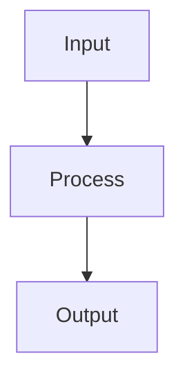

# Pipeline Framework Documentation Site

This directory contains the documentation site for the Pipeline Framework, built with VitePress and hosted on Cloudflare Pages.

## Content Source

The main content for this documentation site comes from [`../pipeline-framework/README.md`](../pipeline-framework/README.md), which serves as the home page. Additional guides and documentation are in this directory.

## Development

To run the documentation site locally:

```bash
cd docs
npm install
npm run dev
```

The site will be available at http://localhost:5173

## Building

To build the static site:

```bash
cd docs
npm run build
```

The built site will be in `docs/.vitepress/dist`

## Mermaid Diagrams

This documentation site supports Mermaid diagrams for visualizing workflows and architectures. The site uses the `vitepress-plugin-mermaid` plugin which enables GitHub-style Mermaid syntax:

````

````

**Note**: Using Mermaid diagrams significantly increases the bundle size (currently ~4.8MB vs 1.5MB without Mermaid) as the plugin includes many different diagram types and their dependencies in the bundle. This is a trade-off between rich visualization capabilities and site performance.

## Deployment to Cloudflare Pages

### Prerequisites

1. A Cloudflare account
2. The project repository connected to Cloudflare Pages

### Build Configuration

When setting up the project in Cloudflare Pages, use the following Vitepress configuration:

- **Build command**: `npm run build`
- **Build output directory**: `.vitepress/dist`
- **Root directory**: `/`, `docs`

### New Features

The documentation site now includes:

1. **Search Functionality**: Users can search across all documentation pages using the search bar in the top navigation
2. **Multi-Version Support**: Documentation is available for multiple versions of the Pipeline Framework:
   - v0.9.0 (current)
   - v0.8.0
   - v0.7.0
3. **Mermaid Diagram Support**: Rich diagrams for visualizing workflows (with increased bundle size)

### Configuration Notes

The VitePress configuration includes `ignoreDeadLinks: true` to prevent build failures due to links that are valid in the context of the full project but not within the documentation site. This is necessary because:

1. The documentation site only covers the Pipeline Framework, not the entire project
2. Many markdown files in the project contain links that are valid in the context of the full repository but aren't relevant to the documentation site
3. There are localhost links in various README files that can't be resolved during the build process

This is a common configuration for documentation sites that are part of larger projects.

### Manual Deployment (Optional)

If you prefer to deploy manually, you can use Wrangler:

1. Install Wrangler:
   ```bash
   npm install -g wrangler
   ```

2. Build the documentation:
   ```bash
   cd docs && npm run build
   ```

3. Deploy to Cloudflare Pages:
   ```bash
   wrangler pages deploy docs/.vitepress/dist --project-name=your-project-name
   ```

### Environment Variables

No special environment variables are required for the basic setup.

### Custom Domain

After deployment, you can configure a custom domain through the Cloudflare dashboard.