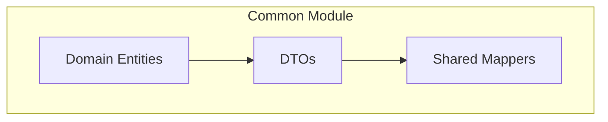

# Common Module Structure

The common module contains shared components used across all services in a pipeline application.

## Domain Entities

Domain entities represent the core business concepts:

```java
// common/src/main/java/com/example/app/common/domain/PaymentRecord.java
public class PaymentRecord {
    private UUID id;
    private String csvId;
    private String recipient;
    private BigDecimal amount;
    private Currency currency;
    // constructors, getters, setters...
}
```

## DTOs

Data Transfer Objects are used for inter-service communication:

```java
// common/src/main/java/com/example/app/common/dto/PaymentRecordDto.java
public class PaymentRecordDto {
    private UUID id;
    private String csvId;
    private String recipient;
    private BigDecimal amount;
    private Currency currency;
    // constructors, getters, setters...
}
```

## Shared Mappers

Mappers that are used across multiple services should be in the common module:

```java
// common/src/main/java/com/example/app/common/mapper/PaymentRecordMapper.java
@Mapper(componentModel = "cdi")
public interface PaymentRecordMapper {
    PaymentRecordMapper INSTANCE = Mappers.getMapper(PaymentRecordMapper.class);
    
    PaymentRecord fromDto(PaymentRecordDto dto);
    PaymentRecordDto toDto(PaymentRecord entity);
    
    // gRPC conversions if needed
    PaymentRecordGrpc fromGrpc(PaymentRecordGrpcOuterClass.PaymentRecord grpc);
    PaymentRecordGrpcOuterClass.PaymentRecord toGrpc(PaymentRecord entity);
}
```

## Module Dependencies Diagram

