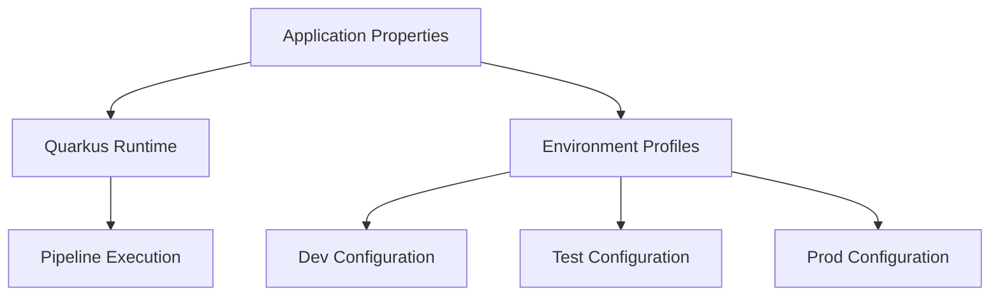

# Configuration

Configure pipeline behavior through application properties and environment-specific profiles.

## Application Properties

Configure pipeline behavior through application properties:

```properties
# application.properties
# Pipeline configuration
pipeline.retry-limit=3
pipeline.debug=false
pipeline.auto-persist=true

# gRPC clients
quarkus.grpc.clients.process-payment.host=localhost
quarkus.grpc.clients.process-payment.port=8080
```

## Environment-Specific Profiles

Use Quarkus profiles for different environments:

```properties
# application-dev.properties
pipeline.debug=true
pipeline.retry-limit=1

# application-prod.properties
pipeline.retry-limit=5
pipeline.retry-wait=1S
```

## Configuration Architecture

