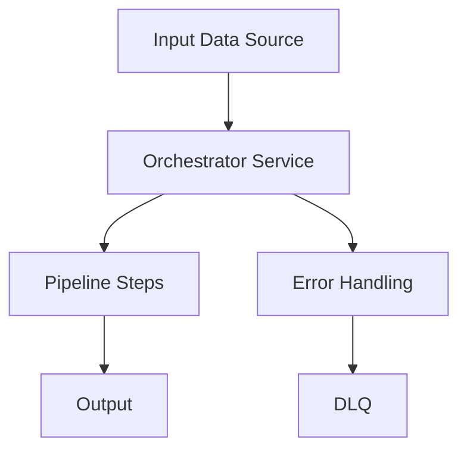

# Orchestrator Service Structure

The orchestrator service coordinates the pipeline execution and manages the overall flow of data through the pipeline.

## Pipeline Application

The orchestrator extends the framework's `PipelineApplication`:

```java
// orchestrator-svc/src/main/java/com/example/app/orchestrator/CsvPaymentsApplication.java
@QuarkusMain
@CommandLine.Command(
    name = "csv-payments",
    mixinStandardHelpOptions = true,
    version = "1.0.0",
    description = "Process CSV payment files")
public class CsvPaymentsApplication extends PipelineApplication implements Runnable, QuarkusApplication {
    
    @Inject ProcessFolderService processFolderService;
    
    @CommandLine.Option(
        names = {"-c", "--csv-folder"},
        description = "The folder path containing CSV payment files",
        defaultValue = "${env:CSV_FOLDER_PATH:-csv/}")
    String csvFolder;
    
    @Override
    public void run() {
        processPipeline(csvFolder);
    }
    
    @Override
    public void processPipeline(String input) {
        // Process input and create stream
        Stream<CsvPaymentsInputFile> inputFileStream = processFolderService.process(input);
        Multi<CsvPaymentsInputFile> inputMulti = Multi.createFrom().iterable(inputFileStream::iterator);
        
        // Execute pipeline with generated steps
        executePipeline(inputMulti, List.of());
    }
}
```

## Pipeline Execution Service

Handles the orchestration logic:

```java
// orchestrator-svc/src/main/java/com/example/app/orchestrator/service/ProcessFolderService.java
@ApplicationScoped
public class ProcessFolderService {
    
    public Stream<CsvPaymentsInputFile> process(String csvFolderPath) {
        // Logic to read CSV files and convert to domain objects
        return Stream.of(/* ... */);
    }
}
```

## Orchestrator Architecture

