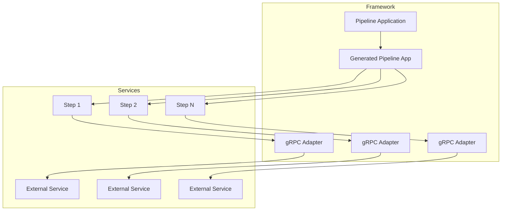
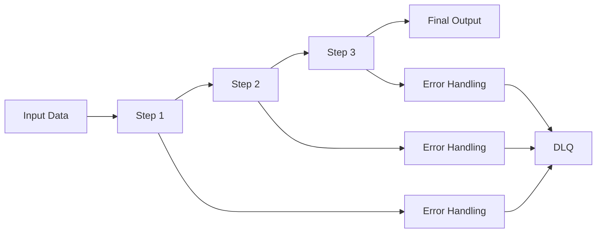

<HeroSection
  :primaryCta="{ text: 'Get Started', href: '/guide/getting-started' }"
  :secondaryCta="{ text: 'View Source', href: 'https://github.com/mbarcia/CSV-Payments-PoC' }"
  :features="[
    {
      title: 'Reactive by Design',
      description: 'Built on Mutiny for non-blocking, high-performance applications'
    },
    {
      title: 'Annotation Driven',
      description: 'Simple annotations generate complex infrastructure automatically'
    },
    {
      title: 'Observability First',
      description: 'Built-in metrics, tracing, and logging support'
    },
    {
      title: 'Resilient by Default',
      description: 'Comprehensive error handling with dead letter queues'
    }
  ]"
/>

## Table of Contents

1. [Introduction](#introduction)
2. [Core Concepts](#core-concepts)
3. [Architecture](#architecture)
4. [Getting Started](#getting-started)
5. [Creating Backend Services](#creating-backend-services)
6. [Creating Orchestrator Services](#creating-orchestrator-services)
7. [Application Structure](#application-structure)
8. [Pipeline Compilation and Generation](#pipeline-compilation-and-generation)
9. [Concurrency, Error Handling, and DLQ](#concurrency-error-handling-and-dlq)
10. [Observability](#observability)
11. [Best Practices](#best-practices)

## Introduction

The Pipeline Framework is a powerful tool for building reactive pipeline processing systems. It simplifies the development of distributed systems by providing a consistent way to create, configure, and deploy pipeline steps.

### Key Features

- **Reactive Programming**: Built on top of Mutiny for non-blocking operations
- **Annotation-Based Configuration**: Simplifies adapter generation with `@PipelineStep`
- **gRPC and REST Support**: Automatically generates adapters for both communication protocols
- **Modular Design**: Clear separation between runtime and deployment components
- **Auto-Generation**: Generates necessary infrastructure at build time
- **Observability**: Built-in metrics, tracing, and logging support
- **Error Handling**: Comprehensive error handling with DLQ support
- **Concurrency Control**: Virtual threads and backpressure management

## Core Concepts

### Pipeline
A pipeline is a sequence of processing steps that transform input data into output data. Each step in the pipeline performs a specific transformation or operation on the data flowing through it.

### Step
A step is a single processing unit within a pipeline. Steps can have different patterns:

- **One-to-One**: Transforms a single input into a single output
- **One-to-Many**: Transforms a single input into multiple outputs
- **Many-to-One**: Aggregates multiple inputs into a single output
- **Many-to-Many**: Transforms multiple inputs into multiple outputs
- **Side Effect**: Performs an operation without changing the data flow

### Mapper
Mappers handle the conversion between different data representations:
- **gRPC objects**: Protocol buffer generated classes
- **Domain objects**: Business logic entities
- **DTO objects**: Data transfer objects

### Adapter
Adapters bridge the gap between the pipeline framework and external systems, handling protocol-specific details like gRPC or REST communication.

## Architecture

The Pipeline Framework follows a modular architecture with clear separation of concerns:

### Runtime Module
Contains the core framework components:
- Annotations (`@PipelineStep`)
- Interfaces (Step interfaces, Mapper interfaces)
- Base classes and utilities
- Configuration classes
- Persistence managers

### Deployment Module
Contains build-time processors:
- Annotation processor that scans for annotations
- Code generator for adapters and pipeline applications
- Dependency injection registration

### System Components



### Overflow Configuration

The framework includes comprehensive overflow handling with configurable strategies:

- **BUFFER**: Buffers items when downstream consumers cannot keep up (default) - implemented as `onOverflow().buffer(capacity)`
- **DROP**: Drops items when downstream consumers cannot keep up - implemented as `onOverflow().drop()`  

Note: In Mutiny 2.9.4, the explicit `onOverflow().fail()` method is not available. By default, Mutiny will signal an error when overflow occurs if no other overflow strategy is specified.

```java
@PipelineStep(
    // ... other configuration
    backpressureBufferCapacity = 1024,     // Buffer capacity when using BUFFER strategy
    backpressureStrategy = "BUFFER"        // BUFFER, DROP, or ERROR strategy
)
```

## Pipeline Data Flow

The data flows through the pipeline as follows:



## Getting Started

### Prerequisites

- Java 21 or higher
- Maven 3.8+
- A Quarkus-based project

### Adding Dependencies

Add the following dependency to your `pom.xml`. Both runtime and deployment components are bundled in a single dependency:

```xml
<dependency>
  <groupId>io.github.mbarcia</groupId>
  <artifactId>pipeline-framework</artifactId>
  <version>LATEST_VERSION</version>
</dependency>
```

### Basic Setup

1. Annotate your service class with `@PipelineStep`
2. Implement the appropriate step interface
3. Create your mapper classes
4. Build your project to trigger code generation

## Creating Backend Services

### Service Definition

Create a service that implements a step interface:

```java
@PipelineStep(
    order = 1,
    inputType = PaymentRecord.class,
    outputType = PaymentStatus.class,
    stepType = StepOneToOne.class,
    backendType = GenericGrpcReactiveServiceAdapter.class,
    grpcStub = MutinyProcessPaymentServiceGrpc.MutinyProcessPaymentServiceStub.class,
    grpcImpl = MutinyProcessPaymentServiceGrpc.ProcessPaymentServiceImplBase.class,
    inboundMapper = PaymentRecordInboundMapper.class,
    outboundMapper = PaymentStatusOutboundMapper.class,
    grpcClient = "process-payment",
    autoPersist = true,
    debug = true
)
@ApplicationScoped
public class ProcessPaymentService implements StepOneToOne<PaymentRecord, PaymentStatus> {
    
    @Override
    public Uni<PaymentStatus> applyOneToOne(PaymentRecord paymentRecord) {
        // Implementation here
        return Uni.createFrom().item(/* processed payment status */);
    }
}
```

### Mapper Implementation

Create mappers for data conversion:

```java
@ApplicationScoped
public class PaymentRecordInboundMapper implements InboundMapper<PaymentRecordGrpc, PaymentRecord> {
    
    @Override
    public PaymentRecord fromGrpc(PaymentRecordGrpc grpc) {
        return PaymentRecord.builder()
            .id(UUID.fromString(grpc.getId()))
            .csvId(grpc.getCsvId())
            .recipient(grpc.getRecipient())
            .amount(new BigDecimal(grpc.getAmount()))
            .currency(Currency.getInstance(grpc.getCurrency()))
            .build();
    }
}
```

## Creating Orchestrator Services

### Orchestrator Definition

Create an orchestrator that extends `PipelineApplication`:

```java
@QuarkusMain
@CommandLine.Command(
    name = "csv-payments",
    mixinStandardHelpOptions = true,
    version = "1.0.0",
    description = "Process CSV payment files")
public class CsvPaymentsApplication extends PipelineApplication implements Runnable, QuarkusApplication {

    @Inject ProcessFolderService processFolderService;
    
    @CommandLine.Option(
        names = {"-c", "--csv-folder"},
        description = "The folder path containing CSV payment files",
        defaultValue = "${env:CSV_FOLDER_PATH:-csv/}")
    String csvFolder;

    @Override
    public void run() {
        processPipeline(csvFolder);
    }
    
    @Override
    public void processPipeline(String input) {
        // Process input and create stream
        Stream<CsvPaymentsInputFile> inputFileStream = processFolderService.process(input);
        Multi<CsvPaymentsInputFile> inputMulti = Multi.createFrom().iterable(inputFileStream::iterator);
        
        // Execute pipeline with generated steps
        executePipeline(inputMulti, List.of());
    }
}
```

## Application Structure

### Recommended Project Layout

```
my-pipeline-application/
├── pom.xml                           # Parent POM
├── common/                           # Shared components
│   ├── pom.xml
│   └── src/main/java/
│       └── com/example/app/common/
│           ├── domain/               # Domain entities
│           ├── dto/                  # Data transfer objects
│           └── mapper/               # Shared mappers
├── orchestrator-svc/                 # Pipeline orchestrator
│   ├── pom.xml
│   └── src/main/java/
│       └── com/example/app/orchestrator/
│           └── CsvPaymentsApplication.java
├── step-one-svc/                     # First pipeline step
│   ├── pom.xml
│   └── src/main/java/
│       └── com/example/app/stepone/
│           └── service/
└── pipeline-framework/               # Framework modules
    ├── runtime/
    └── deployment/
```

## Pipeline Compilation and Generation

### Annotation Processing

The framework's annotation processor automatically generates:

1. **gRPC Adapters**: Server-side endpoints for service exposure
2. **Step Classes**: Client-side implementations for pipeline execution
3. **Pipeline Applications**: Orchestrators that include all steps

### Generated Code Example

```java
// Generated: ProcessPaymentServiceGrpcService.java
@GrpcService
public class ProcessPaymentServiceGrpcService extends GenericGrpcReactiveServiceAdapter<...> {
    @Inject PaymentRecordInboundMapper inboundMapper;
    @Inject PaymentStatusOutboundMapper outboundMapper;
    @Inject ProcessPaymentService service;
}

// Generated: ProcessPaymentServiceStep.java  
@ApplicationScoped
public class ProcessPaymentServiceStep implements StepOneToOne<PaymentRecord, PaymentStatus> {
    @Inject MutinyProcessPaymentServiceGrpc.MutinyProcessPaymentServiceStub grpcClient;
}
```

## Concurrency, Error Handling, and DLQ

### Virtual Threads

Enable virtual threads for high-throughput I/O operations:

```java
@PipelineStep(
    // ... other configuration
    runWithVirtualThreads = true
)
```

### Retry Mechanisms

Configure automatic retries with exponential backoff:

```java
@PipelineStep(
    // ... other configuration
    retryLimit = 5,
    retryWait = "PT1S",
    maxBackoff = "PT30S",
    jitter = true
)
```

### Dead Letter Queue

Enable DLQ for failed items:

```java
@PipelineStep(
    // ... other configuration
    recoverOnFailure = true,
    autoPersist = true
)
```

Implement custom DLQ handling:

```java
@Override
public Uni<PaymentStatus> deadLetter(PaymentRecord paymentRecord, Throwable error) {
    // Send to DLQ (database, message queue, etc.)
    return persistToDeadLetterQueue(paymentRecord, error)
        .onItem().transform(v -> createDlqStatus(paymentRecord));
}
```

## Observability

### Metrics Collection

Built-in metrics and custom metric collection:

```java
@Inject MetricRegistry metricRegistry;

private Timer processingTimer;
private Counter successCounter;
private Counter failureCounter;

@PostConstruct
void initializeMetrics() {
    processingTimer = metricRegistry.timer("payment.processing.duration");
    successCounter = metricRegistry.counter("payment.processing.success");
    failureCounter = metricRegistry.counter("payment.processing.failure");
}
```

### Distributed Tracing

OpenTelemetry integration:

```java
@Inject Tracer tracer;

@Override
public Uni<PaymentStatus> applyOneToOne(PaymentRecord paymentRecord) {
    Span span = tracer.spanBuilder("process-payment")
        .setAttribute("payment.id", paymentRecord.getId().toString())
        .startSpan();
        
    try (Scope scope = span.makeCurrent()) {
        return processPayment(paymentRecord)
            .onItem().invoke(result -> span.setStatus(StatusCode.OK))
            .onFailure().invoke(error -> {
                span.recordException(error);
                span.setStatus(StatusCode.ERROR, error.getMessage());
            });
    } finally {
        span.end();
    }
}
```

### Structured Logging

JSON logging with MDC context:

```properties
# application.properties
quarkus.log.handler.console.json.enabled=true
quarkus.log.handler.console.json.fields.timestamp.field-name=@timestamp
```

```java
MDC.put("paymentId", paymentRecord.getId().toString());
LOG.info("Processing payment record");
```

## Best Practices

### Design Principles

1. **Single Responsibility**: Each service should have one clear purpose
2. **Statelessness**: Keep services stateless when possible
3. **Immutability**: Use immutable objects where feasible
4. **Fail Fast**: Validate inputs early and fail fast
5. **Graceful Degradation**: Handle failures gracefully

### Performance Considerations

1. **Use Virtual Threads**: Leverage virtual threads for I/O-bound operations
2. **Avoid Blocking Operations**: Use reactive patterns throughout
3. **Efficient Memory Usage**: Be mindful of memory allocation in hot paths
4. **Batch Processing**: Consider batching for high-volume scenarios

### Security

1. **Input Validation**: Validate all inputs thoroughly
2. **Sanitization**: Sanitize data before processing
3. **Authentication**: Implement proper authentication for service-to-service communication
4. **Authorization**: Check permissions where appropriate

### Maintainability

1. **Clear Naming**: Use descriptive names for classes, methods, and variables
2. **Documentation**: Document complex logic and edge cases
3. **Testing**: Write comprehensive tests for all scenarios
4. **Configuration**: Make behavior configurable where appropriate

### Monitoring and Observability

1. **Structured Logging**: Use structured logging with trace IDs
2. **Metrics Collection**: Collect and expose pipeline metrics
3. **Health Checks**: Implement health check endpoints
4. **Tracing**: Enable distributed tracing for pipeline steps

The Pipeline Framework provides a comprehensive platform for building reactive, scalable, and observable pipeline applications. By following these guidelines and leveraging the framework's features, you can create robust distributed systems that are easy to maintain and monitor.