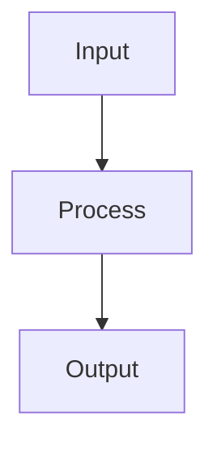

# Creating Pipeline Steps

This guide explains how to create your own pipeline steps using The Pipeline Framework.

## Step 1: Create Your Service Class

Create a class that implements one of the step interfaces:

```java
@PipelineStep(
   order = 1,
   stub = MyGrpc.MyStub.class,
   inboundMapper = FooRequestToDomainMapper.class,
   outboundMapper = DomainToBarResponseMapper.class
)
public class MyPipelineStep implements StepOneToOne<FooRequest, BarResponse> {
    @Override
    public Uni<BarResponse> apply(Uni<FooRequest> request) {
        // Your implementation here
        return request.map(req -> {
            // Transform the request
            return new BarResponse();
        });
    }
}
```

## Step 2: Create Your Mapper Classes

Create mapper classes for converting between gRPC and domain types:

```java
@MapperForStep(
    order = 1,
    grpcType = FooRequest.class,
    domainType = DomainFooRequest.class
)
public class FooRequestToDomainMapper implements InboundMapper<FooRequest, DomainFooRequest> {
    @Override
    public DomainFooRequest map(FooRequest source) {
        // Mapping implementation
        return new DomainFooRequest();
    }
}
```

## Step 3: Build Your Project

When you build your project, the framework will automatically generate the necessary adapters and register your step in the pipeline.

## Best Practices

1. Keep your step implementations focused on a single responsibility
2. Use the configuration options in `@PipelineStep` to control behavior
3. Implement proper error handling in your mappers
4. Test your steps in isolation before integrating them into the pipeline

## Diagrams

If you need to include diagrams in your documentation, you can use Mermaid syntax which is supported by the documentation system. For example:

