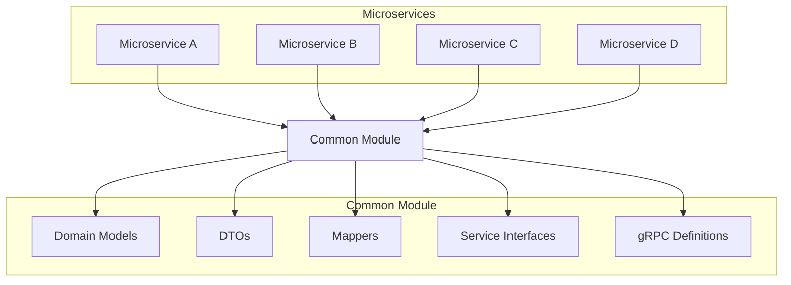

# Common Module

[](https://github.com/mbarcia/CSV-Payments-PoC/actions/workflows/tests.yaml)

## Overview

The Common Module is a shared library component that provides domain models, data transfer objects (DTOs), mapping utilities, and service interfaces used across all microservices in the CSV Payments POC project. It acts as the foundation for consistent data structures and communication patterns throughout the system.

## Key Components

### Domain Models

Shared entity classes that represent the core business concepts:

- `PaymentRecord`: Represents an individual payment entry from input CSV files
- `PaymentStatus`: Contains status information for processed payments
- `PaymentOutput`: Represents a payment entry for output CSV files
- `CsvPaymentsInputFile`: Wrapper for input CSV files
- `CsvPaymentsOutputFile`: Wrapper for output CSV files
- `CsvFolder`: Represents a folder containing CSV files
- `AckPaymentSent`: Acknowledgment for sent payments

### Data Transfer Objects (DTOs)

Lightweight data containers for transferring data between services:

- `PaymentRecordDto`
- `PaymentStatusDto`
- `PaymentOutputDto`
- `AckPaymentSentDto`

### Mappers

MapStruct-based mappers for converting between domain models, DTOs, and gRPC messages:

- `PaymentRecordMapper`
- `PaymentStatusMapper`
- `PaymentOutputMapper`
- `CsvPaymentsInputFileMapper`
- `CsvPaymentsOutputFileMapper`
- `AckPaymentSentMapper`
- `SendPaymentRequestMapper`

### Service Interfaces

Generic service interfaces and adapters that provide common patterns (see "Service Interface Patterns" section for more details):

- `ReactiveStreamingService`: Interface for services that process objects and return streams
- `ReactiveService`: Interface for services that process objects and return single results
- `ReactiveStreamingClientService`: Interface for client services that consume streaming responses
- `GrpcServiceStreamingAdapter`: Adapter for implementing gRPC server-streaming services
- `GrpcServiceClientStreamingAdapter`: Adapter for implementing gRPC client-streaming services
- `GrpcReactiveServiceAdapter`: Adapter for implementing gRPC unary services

## Architecture



## gRPC Definitions

The common module includes shared Protocol Buffer definitions for all services:

- `input_csv_file_processing_svc.proto`: Input CSV file processing service contract
- `payments_processing_svc.proto`: Payments processing service contract
- `payment_status_svc.proto`: Payment status service contract
- `output_csv_file_processing_svc.proto`: Output CSV file processing service contract

## Technology Stack

- **Lombok**: Reduces boilerplate code in Java classes
- **MapStruct**: Code generation for bean mappings
- **Protocol Buffers**: Language-neutral, platform-neutral serialization
- **gRPC**: High-performance RPC framework
- **JPA/Hibernate**: Object-relational mapping
- **Mutiny**: Reactive programming library

## Usage

The common module is automatically included as a dependency in all other microservices in the project. To use its components, simply import the required classes:

```java


```

## Service Interface Patterns

The common module provides several generic service interfaces and gRPC adapters that follow reactive programming patterns:

### Reactive Service Interfaces

#### ReactiveStreamingService
A generic interface for services that process an object and return a stream of results:

```java
public interface ReactiveStreamingService<T, S> {
    Multi<S> process(T processableObj);
}
```

#### ReactiveStreamingClientService
Interface for client services that consume streaming requests and return a single response:

```java
public interface ReactiveStreamingClientService<T, S> {
    Uni<S> process(Multi<T> processableObj);
}
```

#### ReactiveService
Interface for services that process an object and return a single result:

```java
public interface ReactiveService<T, S> {
    Uni<S> process(T processableObj);
}
```

### gRPC Adapter Classes

#### GrpcServiceStreamingAdapter
Abstract adapter class that simplifies implementing gRPC server-streaming services (one request, many responses):

```java
public abstract class GrpcServiceStreamingAdapter<GrpcIn, GrpcOut, DomainIn, DomainOut> {
    protected abstract ReactiveStreamingService<DomainIn, DomainOut> getService();
    protected abstract DomainIn fromGrpc(GrpcIn grpcIn);
    protected abstract GrpcOut toGrpc(DomainOut domainOut);
    
    public Multi<GrpcOut> remoteProcess(GrpcIn grpcRequest) {
        return getService()
            .process(fromGrpc(grpcRequest))
            .onItem()
            .transform(this::toGrpc)
            .onFailure()
            .transform(new throwStatusRuntimeExceptionFunction());
    }
}
```

#### GrpcServiceClientStreamingAdapter
Abstract adapter class that simplifies implementing gRPC client-streaming services (many requests, one response):

```java
public abstract class GrpcServiceClientStreamingAdapter<GrpcIn, GrpcOut, DomainIn, DomainOut> {
    protected abstract ReactiveService<Multi<DomainIn>, DomainOut> getService();
    protected abstract DomainIn fromGrpc(GrpcIn grpcIn);
    protected abstract GrpcOut toGrpc(DomainOut domainOut);
    
    public Uni<GrpcOut> remoteProcess(Multi<GrpcIn> requests) {
        return getService()
            .process(requests.onItem().transform(this::fromGrpc))
            .onItem()
            .transform(this::toGrpc)
            .onFailure()
            .transform(new throwStatusRuntimeExceptionFunction());
    }
}
```

#### GrpcReactiveServiceAdapter
Abstract adapter class that simplifies implementing gRPC unary services (one request, one response):

```java
public abstract class GrpcReactiveServiceAdapter<GrpcIn, GrpcOut, DomainIn, DomainOut> {
    protected abstract ReactiveService<DomainIn, DomainOut> getService();
    protected abstract DomainIn fromGrpc(GrpcIn grpcIn);
    protected abstract GrpcOut toGrpc(DomainOut domainOut);
    
    public Uni<GrpcOut> remoteProcess(GrpcIn grpcRequest) {
        return getService()
            .process(fromGrpc(grpcRequest))
            .onItem()
            .transform(this::toGrpc)
            .onFailure()
            .transform(new throwStatusRuntimeExceptionFunction());
    }
}
```

## Building the Module

```bash
mvn clean package
```

## Integration with Microservices

All microservices in the CSV Payments POC project depend on the common module:

- [Input CSV File Processing Service](../input-csv-file-processing-svc/README.md)
- [Payments Processing Service](../payments-processing-svc/README.md)
- [Payment Status Service](../payment-status-svc/README.md)
- [Output CSV File Processing Service](../output-csv-file-processing-svc/README.md)
- [Orchestrator Service](../orchestrator-svc/README.md)

Each service uses the common components to ensure consistency in data structures and communication patterns across the entire system.

## Benefits

1. **Consistency**: Ensures all services use the same data models and interfaces
2. **Maintainability**: Centralized location for shared components reduces duplication
3. **Type Safety**: Strong typing through shared domain models and DTOs
4. **Interoperability**: Standardized gRPC contracts enable seamless service communication
5. **Reusability**: Common patterns and utilities reduce development effort