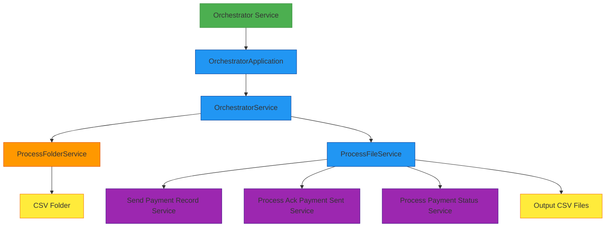
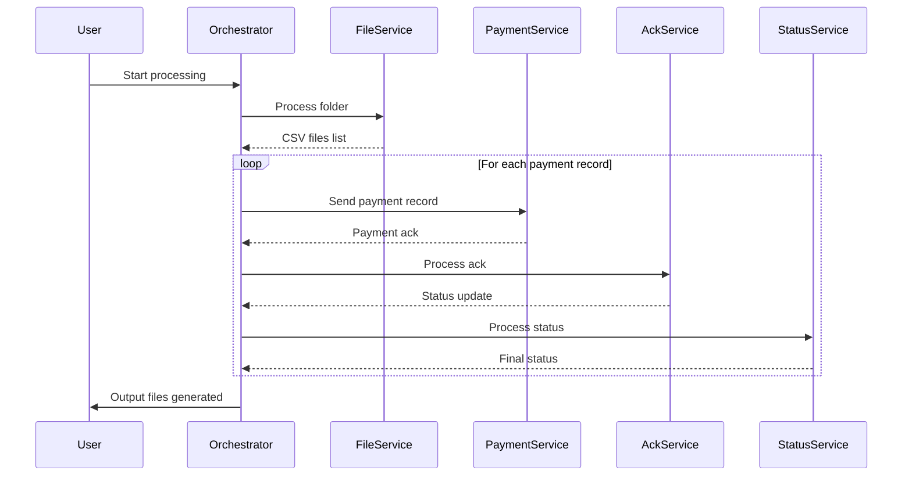

# Orchestrator Service

A Quarkus-based microservice that processes CSV payment files by orchestrating a pipeline of operations through gRPC communications.

## Overview

The orchestrator-svc is responsible for processing CSV files containing payment records. It reads these files from a specified folder, processes each payment record through a multi-step pipeline, and generates output files with the results.



## Functionality

### Main Purpose
The service processes CSV files containing payment records, coordinating with other services via gRPC to handle each step of the payment processing pipeline.

### Entry Point
The main entry point is `OrchestratorApplication.java`, which uses Picocli for command-line argument parsing. It accepts a folder path containing CSV files as input via the `-i` or `--input` option.

#### Input Configuration Options
The application supports multiple ways to specify the input:

1. **Command-line argument** (highest priority):
   ```bash
   java -jar app.jar -i /path/to/input
   ```

2. **Environment variable** (fallback when command-line argument not provided):
   ```bash
   PIPELINE_INPUT=/path/to/input java -jar app.jar
   # Or when running with quarkus:dev
   PIPELINE_INPUT=/path/to/input ./mvnw quarkus:dev
   ```

The application checks for these options in the following priority:
1. Command-line argument (`-i` or `--input`) - highest priority
2. Environment variable (`PIPELINE_INPUT`) - used when command-line argument is not provided

When running in dev mode via IDE, make sure the environment variable is properly set in your run configuration.

### Core Processing Flow



### Processing Pipeline Details
1. **File Discovery**: `ProcessFolderService` scans the folder for CSV files and creates corresponding input/output file objects
2. **Record Processing**: For each file, `ProcessFileService` processes individual payment records through a multi-step pipeline:
   - Sending the payment record to the payment service
   - Processing an acknowledgment from the ack service
   - Processing the final payment status from the status service
3. **Concurrency**: Processing is done concurrently using virtual threads for efficiency

### gRPC Communication
The service communicates with other services via gRPC, using clients injected with `@GrpcClient`:
- Processing input CSV files
- Sending payment records
- Processing acknowledgments
- Processing payment statuses
- Processing output CSV files

### Error Handling
- Implements retry mechanisms with exponential backoff for transient errors (like throttling)
- Handles errors gracefully with detailed logging

### Configuration System

The orchestrator service uses a flexible configuration system that allows you to configure both pipeline-level and step-level behaviors:

- **Pipeline-level configuration**: Configure defaults and profiles for the entire pipeline
- **Step-level configuration**: Override settings for individual steps
- **Profile management**: Switch between different configurations based on environment (dev, prod, etc.)

For detailed information on how to use the configuration system, see [Configuration Guide](../pipeline-framework/docs/CONFIGURATION_CONSOLIDATED.md).

### Dependencies
- Uses components from the `common` module for domain objects and mappers
- Relies on gRPC for communication with other services
- Uses OpenCSV for handling CSV file operations
- Uses MapStruct for object mapping between domain objects and gRPC messages
