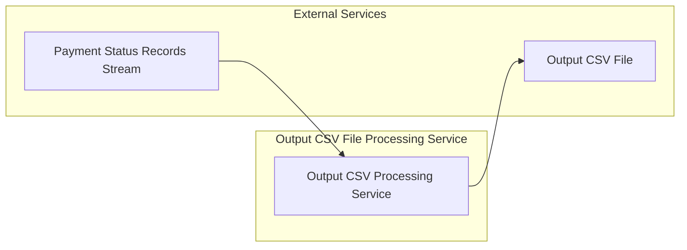

# Output CSV File Processing Service

[](https://github.com/mbarcia/CSV-Payments-PoC/actions/workflows/tests.yaml)

## Overview

The Output CSV File Processing Service is a Quarkus-based microservice responsible for generating output CSV files containing processed payment information. It consumes streams of payment output records and writes them to properly formatted CSV files.

This service is part of the [CSV Payments POC](../README.md) project, which processes CSV files containing payment information through a series of microservices.

## Key Responsibilities

- Receive streams of `PaymentOutput` records from upstream services
- Generate properly formatted output CSV files based on the processed payment data
- Write output files to the appropriate directory structure
- Handle file writing asynchronously using virtual threads for optimal performance
- Ensure data consistency and proper file formatting

## Architecture



## Technology Stack

- **Quarkus**: Kubernetes-native Java framework
- **OpenCSV**: CSV writing library
- **gRPC**: High-performance RPC communication
- **RESTEasy**: REST API framework
- **Mutiny**: Reactive programming library
- **Lombok**: Boilerplate code reduction
- **MapStruct**: Java bean mappings

## Data Model

The service processes streams of `PaymentOutput` objects which contain:
- `csvId`: Unique identifier from the original CSV
- `recipient`: Recipient phone number
- `amount`: Payment amount
- `currency`: ISO-4217 currency code
- `conversationId`: Reference identifier for the payment
- `status`: Processing status code
- `message`: Status message
- `fee`: Processing fee

The service generates `CsvPaymentsOutputFile` objects which contain:
- File path information
- Directory structure details

## Service Interface

The service exposes both gRPC and REST interfaces:

### gRPC Method

```proto
rpc remoteProcess(stream PaymentOutput) returns (CsvPaymentsOutputFile);
```

This method takes a stream of payment output records and returns a single output file descriptor, making it a client-streaming RPC.

### REST APIs

The service also exposes REST endpoints for easier integration with web applications:

#### Process Payment Outputs to File
```
POST /api/v1/output-processing/process-file
```
Accepts a list of `PaymentOutput` objects and returns a response with the file path and success message.

#### Process Payment Outputs Stream
```
POST /api/v1/output-processing/process
```
Accepts a list of `PaymentOutput` objects and returns a stream of processed outputs.

## Performance Features

- **Asynchronous File Writing**: Uses virtual threads for concurrent file operations
- **Stream Processing**: Processes records as streams and uses iterator-based writing for efficient memory usage
- **Reactive Patterns**: Implements reactive programming with Mutiny for efficient resource utilization

## Getting Started

### Prerequisites

- Java 21
- Maven 3.6+
- Quarkus 3.x

### Building the Service

```bash
mvn clean package
```

### Running the Service

```bash
mvn quarkus:dev
```

Or as a standalone JAR:

```bash
java -jar target/output-csv-file-processing-svc-1.0.jar
```

### Running in Native Mode

```bash
mvn clean package -Pnative
./target/output-csv-file-processing-svc-1.0-runner
```

## Testing

To run the tests, execute:

```bash
mvn test
```

## Integration with Other Services

This service is typically invoked by the Orchestrator Service as part of the payment processing workflow:

1. Orchestrator collects processed payment records from the Payment Status Service
2. Orchestrator calls this service with a stream of payment output records
3. This service generates and writes the output CSV file
4. Orchestrator receives confirmation of successful file creation

The service can also be called directly via REST APIs for integration with web applications and dashboards.

## Configuration

The service inherits its configuration from the parent Quarkus application. See the main [README](../README.md) for general configuration options.

## Related Services

- [Common Module](../common/README.md): Shared domain models and utilities
- [Input CSV File Processing Service](../input-csv-file-processing-svc/README.md): Reads and parses input CSV files
- [Payment Status Service](../payment-status-svc/README.md): Provides processed payment status records
- [Orchestrator Service](../orchestrator-svc/README.md): Coordinates the overall workflow