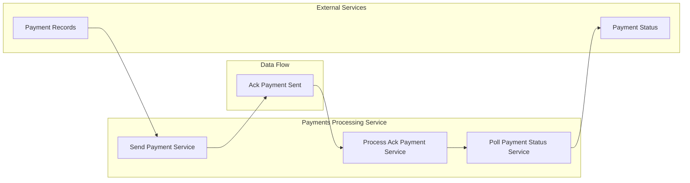

# Payments Processing Service

[](https://github.com/mbarcia/CSV-Payments-PoC/actions/workflows/tests.yaml)

## Overview

The Payments Processing Service is a Quarkus-based microservice responsible for processing individual payment records in the CSV payment processing system. It interacts with a mock payment provider to simulate sending payments and retrieving their status. The service handles the complexities of asynchronous payment processing, including initial acknowledgments and final status retrieval.

This service is part of the [CSV Payments POC](../README.md) project, which processes CSV files containing payment information through a series of microservices.

## Key Responsibilities

- Send payment records to a mock payment provider
- Receive initial acknowledgments for sent payments
- Poll for final payment statuses from the payment provider
- Transform payment responses into standardized formats
- Handle rate limiting and timeout scenarios
- Provide gRPC interfaces for all payment processing operations

## Architecture



## Technology Stack

- **Quarkus**: Kubernetes-native Java framework
- **gRPC**: High-performance RPC communication
- **Mutiny**: Reactive programming library
- **Lombok**: Boilerplate code reduction
- **MapStruct**: Java bean mappings
- **Guava**: Rate limiting utilities

## Data Model

The service processes several key domain objects:

- `PaymentRecord`: Individual payment entry from input CSV files
- `AckPaymentSent`: Initial acknowledgment from the payment provider
- `PaymentStatus`: Final status of a processed payment

## Service Interfaces

The service exposes three gRPC services defined in the proto files, each with equivalent REST endpoints:

### SendPaymentRecordService

```proto
rpc remoteProcess(PaymentRecord) returns (AckPaymentSent);
```

Sends a payment record to the payment provider and returns an initial acknowledgment.

REST Endpoint:
```
POST /api/v1/send-payment
Content-Type: application/json

{
  "id": "UUID",
  "csvId": "string",
  "recipient": "string",
  "amount": "BigDecimal",
  "currency": "Currency",
  "csvPaymentsInputFilePath": "Path"
}
```

Returns an AckPaymentSentDto object in JSON format.

### ProcessAckPaymentSentService

```proto
rpc remoteProcess(AckPaymentSent) returns (PaymentStatus);
```

Processes an acknowledgment and retrieves the final payment status.

REST Endpoint:
```
POST /api/v1/process-ack-payment
Content-Type: application/json

{
  "id": "UUID",
  "conversationId": "UUID",
  "paymentRecordId": "UUID",
  "paymentRecord": {
    // PaymentRecord object
  },
  "message": "string",
  "status": "Long"
}
```

Returns a PaymentStatusDto object in JSON format.

### PollAckPaymentSentService

```proto
rpc remoteProcess(AckPaymentSent) returns (PaymentStatus);
```

Polls the payment provider for the final status of a payment.

REST Endpoint:
```
POST /api/v1/poll-ack-payment
Content-Type: application/json

{
  "id": "UUID",
  "conversationId": "UUID",
  "paymentRecordId": "UUID",
  "paymentRecord": {
    // PaymentRecord object
  },
  "message": "string",
  "status": "Long"
}
```

Returns a PaymentStatusDto object in JSON format.

## Performance Features

- **Rate Limiting**: Implements Guava's RateLimiter to simulate real-world API throttling
- **Reactive Processing**: Leverages Mutiny for non-blocking operations
- **Timeout Handling**: Configurable timeouts for payment provider interactions

## Getting Started

### Prerequisites

- Java 21
- Maven 3.6+
- Quarkus 3.x

### Building the Service

```bash
mvn clean package
```

### Running the Service

```bash
mvn quarkus:dev
```

Or as a standalone JAR:

```bash
java -jar target/payments-processing-svc-1.0.jar
```

### Running in Native Mode

```bash
mvn clean package -Pnative
./target/payments-processing-svc-1.0-runner
```

## Testing

To run the tests, execute:

```bash
mvn test
```

## Configuration

The service uses the following configuration properties:

- `csv-payments.payment-provider.permits-per-second`: Rate limiting configuration (default: 1000.0)
- `csv-payments.payment-provider.timeout-millis`: Timeout for acquiring permits (default: 2000)
- `csv-payments.payment-provider.wait-milliseconds`: Simulated wait time for polling (default: 1000)

## Integration with Other Services

This service is typically invoked by the Orchestrator Service as part of the payment processing workflow:

1. Orchestrator receives payment records from the Input CSV File Processing Service
2. Orchestrator calls SendPaymentRecordService to send each payment
3. Orchestrator receives AckPaymentSent responses
4. Orchestrator calls ProcessAckPaymentSentService to get final statuses
5. Orchestrator forwards payment statuses to the Payment Status Service

## Related Services

- [Common Module](../common/README.md): Shared domain models and utilities
- [Input CSV File Processing Service](../input-csv-file-processing-svc/README.md): Provides payment records
- [Payment Status Service](../payment-status-svc/README.md): Processes payment statuses
- [Orchestrator Service](../orchestrator-svc/README.md): Coordinates the overall workflow