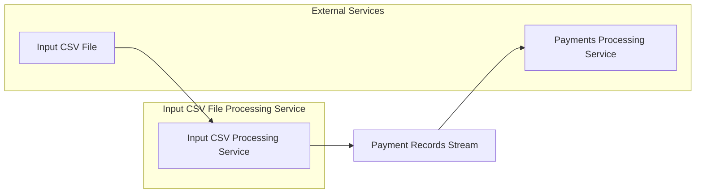

# Input CSV File Processing Service

[](https://github.com/mbarcia/CSV-Payments-PoC/actions/workflows/tests.yaml)

## Overview

The Input CSV File Processing Service is a Quarkus-based microservice responsible for reading and parsing CSV payment files. It extracts individual payment records from input CSV files and streams them for further processing by downstream services.

This service is part of the [CSV Payments POC](../README.md) project, which processes CSV files containing payment information through a series of microservices.

## Key Responsibilities

- Read CSV payment input files from the file system
- Parse CSV files using OpenCSV library with custom mapping strategies
- Extract individual `PaymentRecord` objects from the CSV data
- Stream payment records to downstream services via gRPC
- Handle file processing asynchronously using virtual threads for optimal performance

## Architecture



## Technology Stack

- **Quarkus**: Kubernetes-native Java framework
- **OpenCSV**: CSV parsing library
- **gRPC**: High-performance RPC communication
- **Mutiny**: Reactive programming library
- **Lombok**: Boilerplate code reduction
- **MapStruct**: Java bean mappings

## Data Model

The service processes `CsvPaymentsInputFile` objects which contain:
- File path information
- Stream of `PaymentRecord` objects with fields:
  - `csvId`: Unique identifier from the CSV
  - `recipient`: Recipient phone number
  - `amount`: Payment amount
  - `currency`: ISO-4217 currency code
  - `csvPaymentsInputFilePath`: Source file path

## Service Interface

The service exposes a gRPC interface defined in `ProcessCsvPaymentsInputFileGrpcService` which implements the `ProcessCsvPaymentsInputFileService` contract.

### gRPC Method

```proto
rpc remoteProcess(CsvPaymentsInputFile) returns (stream PaymentRecord);
```

This method takes a CSV file descriptor and returns a stream of individual payment records.

## Performance Features

- **Asynchronous Processing**: Uses virtual threads for concurrent file processing
- **Reactive Streams**: Implements reactive patterns with Mutiny for efficient data streaming
- **Memory Efficient**: Processes files as streams rather than loading entire files into memory

## Getting Started

### Prerequisites

- Java 21
- Maven 3.6+
- Quarkus 3.x

### Building the Service

```bash
mvn clean package
```

### Running the Service

```bash
mvn quarkus:dev
```

Or as a standalone JAR:

```bash
java -jar target/input-csv-file-processing-svc-0.0.1-SNAPSHOT.jar
```

### Running in Native Mode

```bash
mvn clean package -Pnative
./target/input-csv-file-processing-svc-0.0.1-SNAPSHOT-runner
```

## Testing

To run the tests, execute:

```bash
mvn test
```

## Integration with Other Services

This service is typically invoked by the Orchestrator Service as part of the payment processing workflow:

1. Orchestrator Service identifies a new CSV file
2. Orchestrator calls this service to process the file
3. This service streams `PaymentRecord` objects back to the Orchestrator
4. Orchestrator forwards each record to the Payments Processing Service

## Configuration

The service inherits its configuration from the parent Quarkus application. See the main [README](../README.md) for general configuration options.

## Related Services

- [Common Module](../common/README.md): Shared domain models and utilities
- [Payments Processing Service](../payments-processing-svc/README.md): Processes individual payment records
- [Orchestrator Service](../orchestrator-svc/README.md): Coordinates the overall workflow