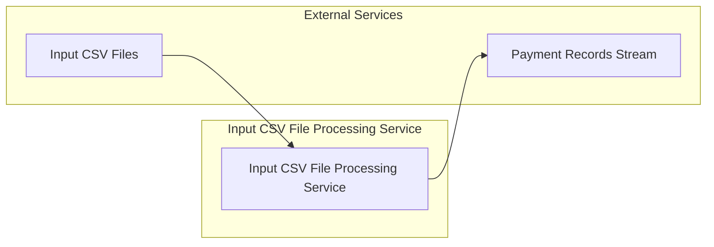

# Input CSV File Processing Service

[](https://github.com/mbarcia/CSV-Payments-PoC/actions/workflows/tests.yaml)

## Overview

The Input CSV File Processing Service is a Quarkus-based microservice responsible for reading and parsing input CSV files containing payment information. It transforms the CSV data into structured payment records that can be processed by downstream services in the payment processing workflow.

This service is part of the [CSV Payments POC](../README.md) project, which processes CSV files containing payment information through a series of microservices.

## Key Responsibilities

- Read and parse input CSV files containing payment data
- Transform CSV rows into structured `PaymentRecord` domain objects
- Stream payment records to downstream services for processing
- Handle both unary and streaming gRPC requests
- Provide REST endpoints for HTTP-based access

## Architecture



## Technology Stack

- **Quarkus**: Kubernetes-native Java framework
- **OpenCSV**: Library for reading and writing CSV files
- **gRPC**: High-performance RPC communication
- **RESTEasy**: JAX-RS implementation for REST endpoints
- **Mutiny**: Reactive programming library
- **Lombok**: Boilerplate code reduction
- **MapStruct**: Java bean mappings

## Data Model

The service processes `CsvPaymentsInputFile` objects which contain:
- File path and folder information for the input CSV
- Metadata about the file being processed

The service produces streams of `PaymentRecord` objects which contain:
- `csvId`: Unique identifier from the CSV
- `recipient`: Name of the payment recipient
- `amount`: Payment amount as a BigDecimal
- `currency`: ISO 4217 currency code
- `csvPaymentsInputFilePath`: Path to the source CSV file

## Service Interfaces

### gRPC Method

```proto
rpc remoteProcess(CsvPaymentsInputFile) returns (stream PaymentRecord);
```

This method takes a CSV file descriptor and returns a stream of payment records, making it a server-streaming RPC.

### REST API

The service now also provides REST endpoints for HTTP-based access:

#### Process CSV Payments Input File

Processes a CSV payments input file and returns a stream of payment records.

```
POST /api/v1/csv-processing/process
Content-Type: application/json

{
  "id": "UUID",
  "filepath": "Path to the CSV file",
  "csvFolderPath": "Path to the CSV folder"
}
```

Streams PaymentRecordDto objects in JSON format.

#### Process CSV Payments Input File to List

Processes a CSV payments input file and returns a list of payment records.

```
POST /api/v1/csv-processing/process-list
Content-Type: application/json

{
  "id": "UUID",
  "filepath": "Path to the CSV file",
  "csvFolderPath": "Path to the CSV folder"
}
```

Returns a list of PaymentRecordDto objects in JSON format:

```json
[
  {
    "id": "UUID",
    "csvId": "string",
    "recipient": "string",
    "amount": "BigDecimal",
    "currency": "Currency",
    "csvPaymentsInputFilePath": "Path"
  }
]
```

## Performance Features

- **Reactive Processing**: Uses Mutiny for non-blocking operations
- **Virtual Threads**: Leverages virtual threads for efficient concurrency
- **Streaming**: Processes and streams data without loading entire files into memory

## Getting Started

### Prerequisites

- Java 21
- Maven 3.6+
- Quarkus 3.x

### Building the Service

```bash
mvn clean package
```

### Running the Service

```bash
mvn quarkus:dev
```

Or as a standalone JAR:

```bash
java -jar target/input-csv-file-processing-svc-0.0.1-SNAPSHOT.jar
```

### Running in Native Mode

```bash
mvn clean package -Pnative
./target/input-csv-file-processing-svc-0.0.1-SNAPSHOT-runner
```

## Testing

To run the tests, execute:

```bash
mvn test
```

## Integration with Other Services

This service is typically the first in the payment processing workflow:

1. Orchestrator identifies input CSV files
2. Orchestrator calls this service to process the files
3. This service streams payment records back to the Orchestrator
4. Orchestrator forwards records to the Payments Processing Service

## Configuration

The service inherits its configuration from the parent Quarkus application. See the main [README](../README.md) for general configuration options.

## Related Services

- [Common Module](../common/README.md): Shared domain models and utilities
- [Payments Processing Service](../payments-processing-svc/README.md): Processes individual payment records
- [Payment Status Service](../payment-status-svc/README.md): Handles payment status updates
- [Orchestrator Service](../orchestrator-svc/README.md): Coordinates the overall workflow