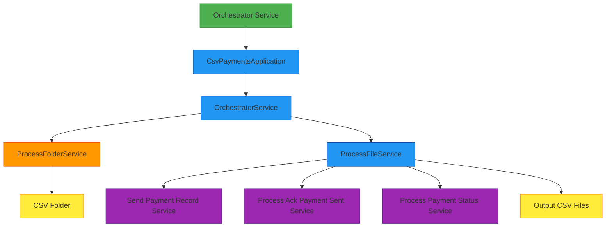
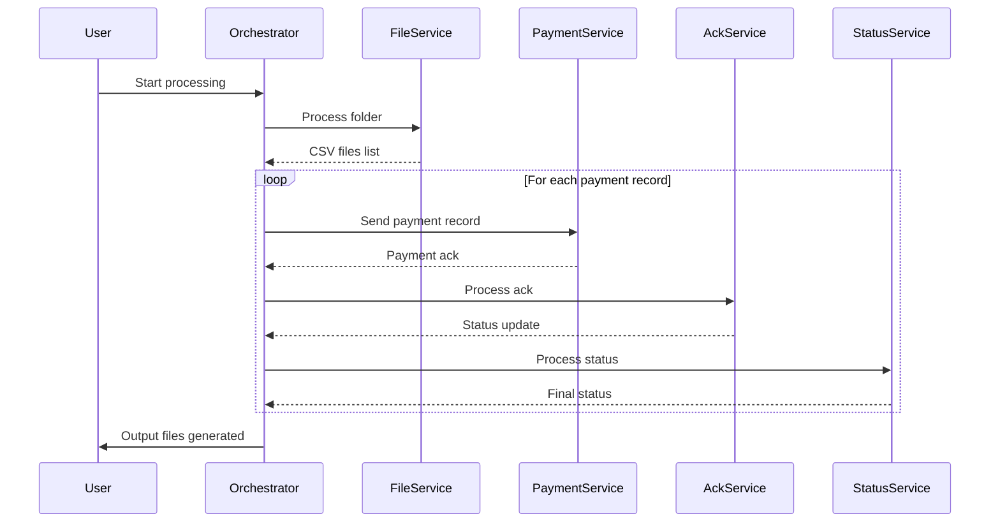

# Orchestrator Service

A Quarkus-based microservice that processes CSV payment files by orchestrating a pipeline of operations through gRPC communications.

## Overview

The orchestrator-svc is responsible for processing CSV files containing payment records. It reads these files from a specified folder, processes each payment record through a multi-step pipeline, and generates output files with the results.

## Functionality

### Main Purpose
The service processes CSV files containing payment records, coordinating with other services via gRPC to handle each step of the payment processing pipeline.

### Entry Point
The main entry point is `CsvPaymentsApplication.java`, which uses Picocli for command-line argument parsing. It accepts a folder path containing CSV files as input (defaulting to an internal `csv/` directory if not specified).

### Core Processing Flow

### Processing Pipeline Details
1. **File Discovery**: `ProcessFolderService` scans the folder for CSV files and creates corresponding input/output file objects
2. **Record Processing**: For each file, `ProcessFileService` processes individual payment records through a multi-step pipeline:
   - Sending the payment record to the payment service
   - Processing an acknowledgment from the ack service
   - Processing the final payment status from the status service
3. **Concurrency**: Processing is done concurrently using virtual threads for efficiency

### gRPC Communication
The service communicates with other services via gRPC, using clients injected with `@GrpcClient`:
- Processing input CSV files
- Sending payment records
- Processing acknowledgments
- Processing payment statuses
- Processing output CSV files

### Concurrency
- Uses Java's virtual threads for concurrent processing, which is efficient for I/O-bound operations
- Controls concurrency with a limit of 1000 concurrent record processing pipelines

### Error Handling
- Implements retry mechanisms with exponential backoff for transient errors (like throttling)
- Handles errors gracefully with detailed logging

### Dependencies
- Uses components from the `common` module for domain objects and mappers
- Relies on gRPC for communication with other services
- Uses OpenCSV for handling CSV file operations
- Uses MapStruct for object mapping between domain objects and gRPC messages