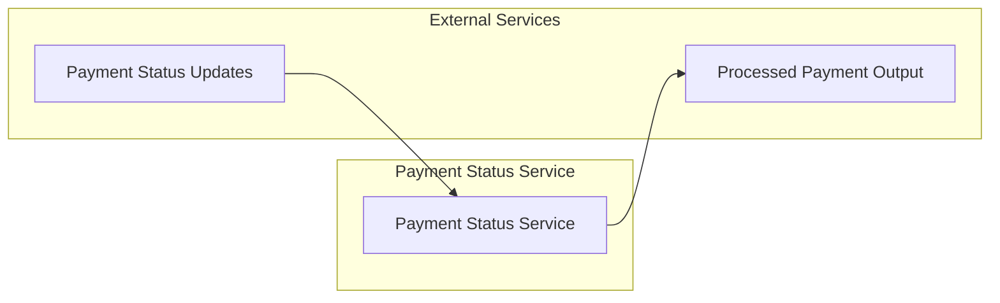

# Payment Status Service

[](https://github.com/mbarcia/CSV-Payments-PoC/actions/workflows/tests.yaml)

## Overview

The Payment Status Service is a Quarkus-based microservice responsible for processing payment status updates in the CSV payment processing system. It receives payment status information, transforms it into output records, and provides the data for generating output CSV files. 

This service is part of the [CSV Payments POC](../README.md) project, which processes CSV files containing payment information through a series of microservices.

## Key Responsibilities

- Receive payment status updates via REST API or gRPC
- Transform payment status data into output records for CSV generation
- Provide processed payment data to downstream services
- Handle both unary and streaming gRPC requests

## Architecture



## Technology Stack

- **Quarkus**: Kubernetes-native Java framework
- **RESTEasy**: JAX-RS implementation for REST endpoints
- **gRPC**: High-performance RPC communication
- **Mutiny**: Reactive programming library
- **Lombok**: Boilerplate code reduction
- **MapStruct**: Java bean mappings

## Data Model

The service processes `PaymentStatus` objects which contain:
- Payment reference and status information
- Fee and message details
- Associated payment records and acknowledgment data

The service produces `PaymentOutput` objects which contain:
- All the fields needed for output CSV generation
- Properly formatted data for the output files

## Service Interfaces

### REST API

```http
POST /payments/status
Content-Type: application/json

{
  "customerReference": "string",
  "reference": "string",
  "status": "string",
  "message": "string",
  "fee": 0,
  "ackPaymentSentId": "UUID",
  "paymentRecordId": "UUID"
}
```

### gRPC Method

```proto
rpc remoteProcess(PaymentStatus) returns (PaymentOutput);
```

This method takes a payment status object and returns a processed payment output object, making it a unary RPC.

## Performance Features

- **Reactive Processing**: Uses Mutiny for non-blocking operations
- **Virtual Threads**: Leverages virtual threads for efficient concurrency

## Getting Started

### Prerequisites

- Java 21
- Maven 3.6+
- Quarkus 3.x

### Building the Service

```bash
mvn clean package
```

### Running the Service

```bash
mvn quarkus:dev
```

Or as a standalone JAR:

```bash
java -jar target/payment-status-svc-1.0.jar
```

### Running in Native Mode

```bash
mvn clean package -Pnative
./target/payment-status-svc-1.0-runner
```

## Testing

To run the tests, execute:

```bash
mvn test
```

## Integration with Other Services

This service is typically invoked by the Orchestrator Service as part of the payment processing workflow:

1. Orchestrator receives processed payment statuses from the Payments Processing Service
2. Orchestrator calls this service to transform the status data
3. This service returns processed payment output records
4. Orchestrator forwards records to the Output CSV File Processing Service

## Configuration

The service inherits its configuration from the parent Quarkus application. See the main [README](../README.md) for general configuration options.

## Related Services

- [Common Module](../common/README.md): Shared domain models and utilities
- [Payments Processing Service](../payments-processing-svc/README.md): Processes individual payment records
- [Output CSV File Processing Service](../output-csv-file-processing-svc/README.md): Generates output CSV files
- [Orchestrator Service](../orchestrator-svc/README.md): Coordinates the overall workflow