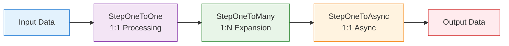
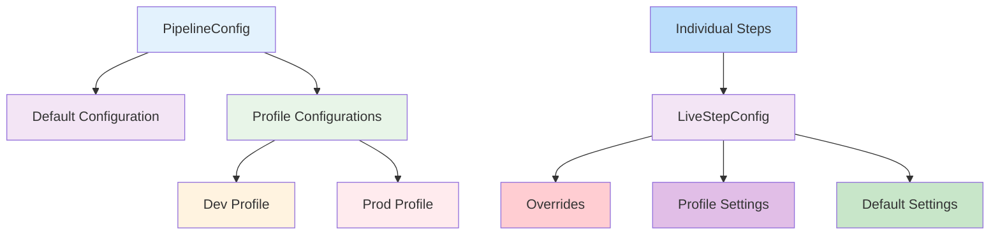

# Pipeline Framework

Welcome to the Pipeline Framework - a robust, scalable, and maintainable solution for processing data through a series of steps with built-in benefits for high-throughput, distributed systems.

## Table of Contents

1. [Overview](#overview)
2. [Key Benefits](#key-benefits)
3. [Getting Started](#getting-started)
4. [Creating New Pipeline Steps](#creating-new-pipeline-steps)
5. [Configuration Guide](#configuration-guide)
6. [Imperative Programming Support](#imperative-programming-support)

## Overview

The pipeline framework is built around several key concepts that enable high-performance, resilient, and maintainable distributed systems:

1. **Step-based Processing**: Each business logic operation is encapsulated in a step that implements a specific interface.
2. **Reactive Programming**: Steps use Mutiny reactive streams for non-blocking I/O operations.
3. **Type Safety**: Steps are strongly typed with clear input and output types that chain together.
4. **Configuration Management**: Steps can be configured globally or individually for retry logic, concurrency, and more.
5. **Observability**: Built-in metrics, tracing, and logging for monitoring and debugging.

## Key Benefits

### 1. High Throughput & Performance
- **Virtual Threads**: Leverages Project Loom's virtual threads for massive concurrency with minimal resource overhead
- **Non-blocking I/O**: Built on Mutiny reactive streams for efficient resource utilization
- **Optimized Execution**: Configurable concurrency limits and thread management
- **Reactive Programming Model**: Business logic services return `Uni<S>` reactive types, enabling efficient resource utilization
- **Backpressure Handling**: Seamless integration with reactive components prevents system overwhelm

### 2. Resilience & Fault Tolerance
- **Automatic Retry Logic**: Exponential backoff retry mechanism with configurable attempts
- **Circuit Breaker Pattern**: Built-in failure detection and isolation
- **Graceful Degradation**: Failures in one step don't cascade to others
- **Comprehensive Error Handling**: Centralized error management with detailed logging
- **Reactive Error Handling**: Seamless integration with Mutiny's error handling capabilities

### 3. Scalability & Flexibility
- **Independent Deployment**: Each step can be deployed, scaled, and versioned separately
- **Microservices Architecture**: Natural fit for distributed systems
- **Cardinality Flexibility**: Support for 1:1, 1:N, and N:1 transformations
- **Horizontal Scaling**: Easy to add more instances of any step
- **Flexible Persistence**: Database persistence is an optional service, not a central requirement
- **Decoupled Data Flow**: No SQL UPDATE commands required, reducing database contention
- **Reactive Service Integration**: Services can leverage the full power of Mutiny for I/O operations, gRPC calls, and database operations with proper error handling and backpressure management

### 4. Observability & Monitoring
- **Distributed Tracing**: Full OpenTelemetry integration for end-to-end visibility
- **Metrics Collection**: Micrometer integration for performance monitoring
- **Structured Logging**: Consistent, contextual logging across all steps
- **Health Checks**: Built-in health monitoring capabilities
- **Automatic Audit Trail**: Built-in persistence creates audit logs of all processed entities

### 5. Developer Productivity
- **Simplified Configuration**: No need to manually configure persistence steps or services
- **Generic Persistence**: Works with any type of entities without modification
- **Zero Setup**: Auto-persistence works out of the box with no additional configuration
- **Reduced Boilerplate**: Framework handles common patterns automatically
- **Easy Customization**: Simple to override default behavior with custom implementations
- **Type Safety**: Strong typing with clear input/output contracts between steps
- **Flexible Testing**: Built-in testing utilities and mock support

### 6. Operational Excellence
- **Configuration Management**: Externalized configuration through Quarkus
- **Runtime Adjustments**: Many parameters can be tuned without code changes
- **Resource Efficiency**: Optimized memory and CPU usage
- **Security Integration**: Built-in TLS support and certificate management

## Getting Started

If you're new to the Pipeline Framework, we recommend starting with understanding how to create your first pipeline step and then learning about the benefits of using this framework.

## Creating New Pipeline Steps

### Understanding the Pipeline Framework

The pipeline framework is designed to provide a robust, scalable, and maintainable way to process data through a series of steps with built-in benefits for high-throughput, distributed systems.

### Key Design Decisions

#### 1. Choosing the Right Step Interface

The pipeline framework provides several step interfaces that match different types of business logic processing:

- **`StepOneToOne<I, O>`**: Transforms one input into one output (1:1) - synchronous processing
- **`StepOneToMany<I, O>`**: Transforms one input into multiple outputs (1:N) - expands data
- **`StepOneToAsync<I, O>`**: Transforms one input into one output (1:1) - asynchronous processing
- **`StepManyToMany`**: Transforms multiple inputs into multiple outputs (N:M) - stream processing

**Important**: The output type of one step becomes the input type of the next step. This creates a strongly-typed pipeline where data flows from one step to the next.

Here's how data flows through a pipeline with different step types:



#### 2. Immutability and Data Flow

Steps work with immutable data objects. There are no in-place updates (no SQL UPDATE commands), which eliminates concurrency issues and race conditions. When data needs to be preserved across steps, it must be explicitly carried forward.

#### 3. Persistence as an Optional Service

Database persistence is an optional service, not a central requirement. Any step can query the database for information if needed, but carrying data forward explicitly is often more efficient.

### Project Structure

Your project will need to have:
- A common package (as a Maven submodule) for shared entities, DTOs, and mappers
- Step packages (as Maven submodules) for each pipeline step
- A parent POM and docker-compose.yaml
- Optionally, TLS certificates

The common module will hold all your entities/dtos and mappers. Also, your .proto definitions for your services. Each RPC service detailed there will probably be a step of the pipeline.

Then for each step, you will have to write a Maven submodule with:
- An implementation of a step interface (this is your actual business logic)
- A gRPC wrapper of that service using `GrpcReactiveServiceAdapter`
- An `application.properties` file
- An optional REST resource class if you want to expose it also to a REST API

### Creating a New Step

#### Step 1: Choose the Appropriate Step Interface

Choose the step interface that matches your business logic:

```java
// For 1:1 transformation with synchronous processing
@ApplicationScoped
public class MyProcessingStep extends ConfigurableStepBase implements StepOneToOne<InputType, OutputType> {
    
    @Override
    public OutputType apply(InputType input) {
        // Your business logic here
        return processInput(input);
    }
    
    private OutputType processInput(InputType input) {
        // Implementation
        return new OutputType(input.getValue());
    }
}

// For 1:N transformation
@ApplicationScoped
public class MyExpandingStep extends ConfigurableStepBase implements StepOneToMany<InputType, OutputType> {
    
    @Override
    public Multi<OutputType> applyMulti(InputType input) {
        // Your business logic here
        return Multi.createFrom().items(createMultipleOutputs(input));
    }
    
    private OutputType[] createMultipleOutputs(InputType input) {
        // Implementation that creates multiple outputs
        return new OutputType[] { /* ... */ };
    }
}

// For async processing
@ApplicationScoped
public class MyAsyncStep extends ConfigurableStepBase implements StepOneToAsync<InputType, OutputType> {
    
    @Override
    public Uni<OutputType> applyAsyncUni(InputType input) {
        // Your async business logic here
        return performAsyncOperation(input);
    }
    
    private Uni<OutputType> performAsyncOperation(InputType input) {
        // Implementation with Uni
        return Uni.createFrom().item(processInput(input));
    }
}
```

#### Step 2: Implement Your Business Logic

Focus on your business requirements without worrying about pipeline concerns. The framework handles retries, logging, metrics, and other cross-cutting concerns.

```java
@ApplicationScoped
public class PaymentValidationStep extends ConfigurableStepBase 
    implements StepOneToOne<PaymentRequest, ValidatedPayment> {
    
    private static final Logger LOG = LoggerFactory.getLogger(PaymentValidationStep.class);
    
    @Inject
    PaymentValidationService validationService;
    
    @Override
    public ValidatedPayment apply(PaymentRequest request) {
        LOG.debug("Validating payment: {}", request.getId());
        
        ValidationResult result = validationService.validate(request);
        
        LOG.debug("Payment validated: {}", request.getId());
        return new ValidatedPayment(request, result.isValid());
    }
}
```

#### Step 3: Configure Execution Properties (Optional)

Steps automatically benefit from the pipeline's built-in features like retries, virtual threads, and observability. You can customize these behaviors by overriding the configuration:

```java
@ApplicationScoped
public class MyConfigurableStep extends ConfigurableStepBase 
    implements StepOneToOne<InputType, OutputType> {
    
    public MyConfigurableStep(PipelineConfig pipelineConfig) {
        super(pipelineConfig);
        
        // Apply step-specific overrides
        liveConfig().overrides()
            .retryLimit(5)
            .retryWait(Duration.ofSeconds(1))
            .concurrency(10)
            .debug(true);
    }
    
    @Override
    public OutputType apply(InputType input) {
        // Your business logic here
        return process(input);
    }
}
```

### Exposing Services Through gRPC and REST

#### gRPC Exposure

To expose your service through gRPC, create a service class that extends the generated gRPC service base class:

```java
@GrpcService
public class YourGrpcService extends MutinyYourServiceGrpc.YourServiceImplBase {

    @Inject YourReactiveService domainService;
    @Inject YourMapper mapper;

    private final GrpcReactiveServiceAdapter<YourGrpcRequest, YourGrpcResponse, YourDomainIn, YourDomainOut> adapter =
            new GrpcReactiveServiceAdapter<>() {
                @Override
                protected ReactiveService<YourDomainIn, YourDomainOut> getService() {
                    return domainService;
                }

                @Override
                protected YourDomainIn fromGrpc(YourGrpcRequest grpcIn) {
                    return mapper.fromGrpc(grpcIn);
                }

                @Override
                protected YourGrpcResponse toGrpc(YourDomainOut domainOut) {
                    return mapper.toGrpc(domainOut);
                }
            };

    @Override
    public Uni<YourGrpcResponse> process(YourGrpcRequest request) {
        return adapter.remoteProcess(request);
    }
}
```

#### REST Exposure

To expose your service through REST, create a JAX-RS resource class:

```java
@Path("/your-service")
public class YourResource {

  @Inject YourReactiveService yourService;

  @POST
  @Path("/process")
  @Consumes(MediaType.APPLICATION_JSON)
  @Produces(MediaType.APPLICATION_JSON)
  public Uni<Response> process(YourRequestDto request) {
    try {
      return yourService.process(request.toDomain())
          .onItem().transform(domainResult -> Response.ok().entity(YourResponseDto.fromDomain(domainResult)).build())
          .onFailure().recoverWithItem(e -> {
            return Response.status(Response.Status.INTERNAL_SERVER_ERROR)
                .entity(new ErrorResponse("Processing failed: " + e.getMessage())).build();
          });
    } catch (Exception e) {
      return Uni.createFrom().item(
          Response.status(Response.Status.INTERNAL_SERVER_ERROR)
              .entity(new ErrorResponse("Processing failed: " + e.getMessage())).build());
    }
  }
}
```

### Client-Side Orchestration

To orchestrate steps on the client side, use the `PipelineRunner`:

```java
public Uni<Void> process(String csvFolderPath) throws URISyntaxException {
    // Create a list of steps to execute
    List<StepBase> steps = List.of(
        new ValidatePaymentStep(),
        new ProcessPaymentStep(),
        new GenerateReceiptStep()
    );
    
    // Create input stream
    Multi<PaymentRequest> input = createPaymentRequests(csvFolderPath);
    
    // Run the pipeline
    PipelineRunner runner = new PipelineRunner();
    Multi<Object> result = runner.run(input, steps);
    
    // Process the results
    return result.collect().asList()
        .onItem().transformToUni(list -> Uni.createFrom().voidItem());
}
```

### Best Practices

1. **Choose the right interface**: Match the step interface to your business logic's input/output cardinality
2. **Keep steps focused**: Each step should have a single responsibility
3. **Make data explicit**: Pass all needed data between steps explicitly rather than relying on database queries
4. **Handle errors gracefully**: Use Mutiny's error handling capabilities
5. **Use configuration**: Leverage the built-in configuration system for tuning behavior
6. **Test thoroughly**: Write unit tests for your business logic and integration tests for step interactions

Each step automatically benefits from:
- Virtual thread execution
- Retry logic (3 attempts by default)
- Structured logging
- Error handling
- Metrics collection
- Distributed tracing

All without any additional code in your business logic.

## Configuration Guide

### Overview

The pipeline framework provides a flexible configuration system that allows developers to configure steps with different settings. The configuration system is based on three main approaches:

1. **Step-level Configuration**: Using `StepConfig`, `PipelineConfig`, and `LiveStepConfig` for configuring individual pipeline steps
2. **Dynamic Configuration**: Using `@ConfigMapping` with `PipelineInitialConfig` for type-safe configuration with runtime updates
3. **ConfigurableStepBase**: Base class for steps that use the configuration system

The configuration hierarchy works as follows:



### Configuration Parameters

The following properties can be configured for each step:

#### 1. retryLimit
- **Type**: int
- **Default**: 3
- **Description**: Specifies the maximum number of times a step will retry after a failure before giving up.

**Example**:
```java
myStep.liveConfig().overrides().retryLimit(5);
```

#### 2. retryWait
- **Type**: Duration
- **Default**: 200ms
- **Description**: The initial delay between retry attempts.

**Example**:
```java
myStep.liveConfig().overrides().retryWait(Duration.ofSeconds(1));
```

#### 3. concurrency
- **Type**: int
- **Default**: 4
- **Description**: Controls how many instances of a step can run concurrently.

**Example**:
```java
myStep.liveConfig().overrides().concurrency(10);
```

#### 4. debug
- **Type**: boolean
- **Default**: false
- **Description**: Enables detailed logging for a step, useful for troubleshooting.

**Example**:
```java
myStep.liveConfig().overrides().debug(true);
```

#### 5. recoverOnFailure
- **Type**: boolean
- **Default**: false
- **Description**: When enabled, allows a step to recover from failures.

**Example**:
```java
myStep.liveConfig().overrides().recoverOnFailure(true);
```

#### 6. runWithVirtualThreads
- **Type**: boolean
- **Default**: false
- **Description**: When enabled, uses virtual threads for blocking operations.

**Example**:
```java
myStep.liveConfig().overrides().runWithVirtualThreads(true);
```

#### 7. maxBackoff
- **Type**: Duration
- **Default**: 30s
- **Description**: The maximum delay between retry attempts when using exponential backoff.

**Example**:
```java
myStep.liveConfig().overrides().maxBackoff(Duration.ofSeconds(10));
```

#### 8. jitter
- **Type**: boolean
- **Default**: false
- **Description**: When enabled, adds randomization to retry delays.

**Example**:
```java
myStep.liveConfig().overrides().jitter(true);
```

### Configuration Hierarchy

1. **Pipeline Defaults**: Set via `pipelineConfig.defaults()`
2. **Profile Configuration**: Set via `pipelineConfig.profile()`
3. **Step Overrides**: Set via `step.liveConfig().overrides()`

### Step-Level Configuration

#### Create a Configurable Step

```java
@ApplicationScoped
public class MyStep extends ConfigurableStepBase implements StepOneToOne<Input, Output> {
    
    @Inject
    public MyStep(PipelineConfig pipelineConfig) {
        super(pipelineConfig);
    }
    
    @Override
    public Output apply(Input input) {
        // Your step logic here
        return output;
    }
}
```

#### Configure Pipeline Defaults

```java
@Inject PipelineConfig pipelineConfig;

// In your application initialization
pipelineConfig.defaults()
    .retryLimit(5)
    .retryWait(Duration.ofSeconds(1))
    .concurrency(8)
    .debug(false);
```

#### Using Configuration Profiles

```java
// Define profiles
pipelineConfig.profile("dev", new StepConfig().retryLimit(1).debug(true));
pipelineConfig.profile("prod", new StepConfig().retryLimit(5).retryWait(Duration.ofSeconds(2)));

// Activate a profile
pipelineConfig.activate("prod");
```

#### Override Step Configuration

```java
@ApplicationScoped
public class MyStep extends ConfigurableStepBase implements StepOneToOne<Input, Output> {
    
    @Inject
    public MyStep(PipelineConfig pipelineConfig) {
        super(pipelineConfig);
        // Apply step-specific overrides
        liveConfig().overrides().retryLimit(5);
    }
}
```

### Dynamic Configuration with @ConfigMapping

For scenarios where you need type-safe configuration with runtime updates, the framework provides a dynamic configuration pattern.

#### Configuration Interface

```java
@ConfigMapping(prefix = "csv-poc.pipeline")
public interface PipelineInitialConfig {
    @WithDefault("1000")
    Integer concurrency();

    @WithDefault("3")
    Integer retryLimit();

    @WithDefault("1000")
    Long retryWaitMs();
}
```

#### Dynamic Configuration Holder

```java
@ApplicationScoped
public class PipelineDynamicConfig {
    private final AtomicReference<PipelineConfigValues> currentConfig = 
        new AtomicReference<>(new PipelineConfigValues(1000, 3, 1000L));
    
    public int getConcurrency() {
        return currentConfig.get().concurrency;
    }
    
    public int getRetryLimit() {
        return currentConfig.get().retryLimit;
    }
    
    public long getRetryWait() {
        return currentConfig.get().retryWaitMs;
    }
    
    public void updateConfig(int concurrency, int retryLimit, long retryWaitMs) {
        currentConfig.set(new PipelineConfigValues(concurrency, retryLimit, retryWaitMs));
    }
    
    public void updateConfig(PipelineInitialConfig staticConfig) {
        updateConfig(
            staticConfig.concurrency(), 
            staticConfig.retryLimit(), 
            staticConfig.retryWaitMs()
        );
    }
}
```

### Configuration Examples

#### Environment-Specific Configuration

```java
@Inject PipelineConfig pipelineConfig;
@Inject PipelineDynamicConfig dynamicConfig;

@PostConstruct
void init() {
    // Development profile
    pipelineConfig.profile("dev", new StepConfig()
        .retryLimit(1)
        .debug(true)
        .concurrency(2));
    
    // Production profile
    pipelineConfig.profile("prod", new StepConfig()
        .retryLimit(5)
        .retryWait(Duration.ofSeconds(1))
        .concurrency(20)
        .debug(false)
        .maxBackoff(Duration.ofMinutes(5))
        .jitter(true));
    
    // Activate appropriate profile based on environment
    String env = System.getenv("ENVIRONMENT");
    pipelineConfig.activate(env != null ? env : "dev");
    
    // Configure individual steps based on their characteristics
    processInputFileStep.liveConfig().overrides()
        .concurrency(50)
        .retryLimit(3)
        .runWithVirtualThreads(true);
}
```

#### Using Environment Variables

```yaml
services:
  orchestrator-svc:
    environment:
      - PIPELINE_RETRY_LIMIT=5
      - PIPELINE_CONCURRENCY=8
      - PROCESS_INPUT_FILE_CONCURRENCY=50
```

```java
@PostConstruct
void init() {
    // Read global defaults from environment
    String retryLimit = System.getenv("PIPELINE_RETRY_LIMIT");
    String concurrency = System.getenv("PIPELINE_CONCURRENCY");
    
    if (retryLimit != null) {
        pipelineConfig.defaults().retryLimit(Integer.parseInt(retryLimit));
    }
    
    if (concurrency != null) {
        pipelineConfig.defaults().concurrency(Integer.parseInt(concurrency));
    }
    
    // Configure individual steps based on environment variables
    String inputFileConcurrency = System.getenv("PROCESS_INPUT_FILE_CONCURRENCY");
    if (inputFileConcurrency != null) {
        processInputFileStep.liveConfig().overrides()
            .concurrency(Integer.parseInt(inputFileConcurrency));
    }
}
```

#### Using Application Properties

```properties
# In application.properties
pipeline.retry-limit=5
pipeline.concurrency=8
pipeline.debug=false

# Step-specific properties
process.input.file.concurrency=50
```

```java
@ConfigProperty(name = "pipeline.retry-limit", defaultValue = "3")
int defaultRetryLimit;

@ConfigProperty(name = "process.input.file.concurrency", defaultValue = "4")
int inputFileConcurrency;

@Inject PipelineConfig pipelineConfig;
@Inject PipelineInitialConfig staticConfig;
@Inject PipelineDynamicConfig dynamicConfig;

@PostConstruct
void init() {
    // Configure defaults
    pipelineConfig.defaults()
        .retryLimit(defaultRetryLimit)
        .concurrency(inputFileConcurrency)
        .debug(false);
    
    // Initialize dynamic configuration from static config
    dynamicConfig.updateConfig(staticConfig);
}
```

### Best Practices

1. **Use profiles**: Define different configuration profiles for different environments
2. **Step-specific configuration**: Use `liveConfig().overrides()` to configure individual steps differently
3. **Environment-specific configuration**: Use environment variables or application properties for environment-specific settings
4. **Monitor performance**: Adjust concurrency levels based on performance monitoring

### Profile Management

The configuration system automatically detects the Quarkus profile and activates the corresponding configuration. You can also manually activate profiles:

```java
pipelineConfig.activate("dev");
```

### Hot Reload

Configuration changes are applied dynamically without restarting the application, thanks to the atomic references used in the configuration classes.

## Imperative Programming Support

### Overview

This guide explains how to use collection-based and Future-based programming (blocking operations) with the Pipeline Framework while still benefiting from its reactive capabilities and auto-persistence features.

### When to Use Collection-Based and Future-Based Steps

Collection-based and Future-based steps are appropriate when:

1. You're not familiar with reactive programming concepts
2. You need to integrate with blocking libraries or services
3. Your organization prefers working with standard Java collections and Futures
4. You don't require high throughput or are okay with lower performance
5. You're using databases like MySQL that may not have optimal reactive support

### Step Interfaces

The Pipeline Framework provides several step interfaces for different programming styles:

#### 1. StepOneToOne<I, O> - Synchronous 1:1 Transformation
The standard interface that already supports blocking operations well.

#### 2. StepOneToManyCollection<I, O> - Collection-based 1:N Transformation
Works with `List<O>` instead of `Multi<O>` for developers who prefer standard Java collections.

#### 3. StepManyToManyCollection - Collection-based N:M Transformation
Works with `List` collections instead of `Multi` streams.

#### 4. StepCompletableFuture<I, O> - Future-based Asynchronous 1:1 Transformation
Works with `CompletableFuture<O>` instead of `Uni<O>` for developers who prefer standard Java Futures.

### How It Works Internally

1. The PipelineRunner wraps your blocking `apply()` method in a reactive context
2. It executes the blocking operation on a virtual thread to prevent platform thread blocking
3. The result is merged back into the reactive stream
4. Auto-persistence works as a side effect without blocking the main flow

### MySQL Configuration

To use MySQL instead of PostgreSQL:

#### 1. Update Dependencies

Replace PostgreSQL dependencies in your `pom.xml`:

```xml
<!-- Replace these PostgreSQL dependencies -->
<dependency>
    <groupId>io.quarkus</groupId>
    <artifactId>quarkus-reactive-pg-client</artifactId>
</dependency>

<!-- With MySQL dependencies -->
<dependency>
    <groupId>io.quarkus</groupId>
    <artifactId>quarkus-reactive-mysql-client</artifactId>
</dependency>
```

#### 2. Update Configuration

In your `application.properties`:

```properties
# Change from PostgreSQL to MySQL
quarkus.datasource.db-kind=mysql
quarkus.datasource.reactive.url=mysql://localhost:3306/mydb
```

### Performance Considerations

#### Benefits of Imperative Approach

1. **Simplicity**: Easier to understand and implement for developers unfamiliar with reactive programming
2. **Compatibility**: Works well with existing blocking libraries and services
3. **Debugging**: Easier to debug with standard tools and techniques

#### Trade-offs

1. **Performance**: Lower throughput compared to fully reactive implementations
2. **Resource Usage**: Uses more threads than pure reactive approaches
3. **Scalability**: May not scale as well under high load

### Best Practices

1. **Use Virtual Threads**: Enable virtual threads for better resource utilization:
   ```java
   validateStep.liveConfig().overrides().runWithVirtualThreads(true);
   ```

2. **Entity Annotations**: Ensure your entities are annotated with `@Entity` for auto-persistence:
   ```java
   @Entity
   public class PaymentRecord {
       // ... fields and methods
   }
   ```

3. **Error Handling**: Implement proper error handling in your imperative steps:
   ```java
   @Override
   public TestPaymentEntity apply(TestPaymentEntity payment) {
       try {
           // Your processing logic
           return processPayment(payment);
       } catch (Exception e) {
           // Handle errors appropriately
           payment.setStatus("FAILED");
           return payment;
       }
   }
   ```

4. **Configuration**: Use the configuration system to control behavior:
   ```java
   validateStep.liveConfig().overrides()
       .autoPersist(true)
       .retryLimit(3)
       .retryWait(Duration.ofSeconds(1));
   ```

### Example Pipeline

Here's a complete example of a pipeline using imperative steps:

```java
// Create entities
TestPaymentEntity payment1 = new TestPaymentEntity("John Doe", new BigDecimal("100.00"));
TestPaymentEntity payment2 = new TestPaymentEntity("Jane Smith", new BigDecimal("250.50"));

Multi<TestPaymentEntity> input = Multi.createFrom().items(payment1, payment2);

// Create imperative steps
ValidatePaymentStep validateStep = new ValidatePaymentStep();
validateStep.liveConfig().overrides().autoPersist(true);

EnrichPaymentStep enrichStep = new EnrichPaymentStep();
enrichStep.liveConfig().overrides().autoPersist(true);

// Run pipeline
PipelineRunner pipelineRunner = new PipelineRunner();
Multi<Object> result = pipelineRunner.run(input, List.of(validateStep, enrichStep));
```

This approach gives you the benefits of the Pipeline Framework (configuration, resilience, observability) while allowing you to write simple imperative code.

## Business Value

### Reduced Time to Market
- Pre-built infrastructure components eliminate boilerplate code
- Standardized patterns accelerate development
- Easy testing and deployment streamline release cycles

### Lower Operational Costs
- Efficient resource utilization reduces infrastructure costs
- Automated resilience features reduce manual intervention
- Independent scaling allows optimal resource allocation per component

### Improved Reliability
- Built-in fault tolerance reduces system downtime
- Comprehensive monitoring enables proactive issue detection
- Standardized error handling improves system stability
- Immutable data flow eliminates concurrency issues and race conditions
- Unidirectional data processing ensures greater data consistency
- Elimination of in-place data updates prevents data corruption scenarios

### Enhanced Maintainability
- Modular architecture simplifies updates and modifications
- Clear separation of concerns makes code easier to understand
- Consistent patterns reduce cognitive load for developers
- Immutable data flow eliminates side effects and makes debugging easier
- Unidirectional data flow provides clear data lineage and traceability

## Technical Implementation Benefits

### For Developers
- Write business logic using reactive programming patterns with Mutiny
- Leverage familiar reactive programming concepts for better performance
- Benefit from Quarkus's fast startup and low memory footprint
- Utilize `Uni<S>` return types for seamless integration with the pipeline framework
- Chain asynchronous operations, handle errors reactively, and transform data using Mutiny's rich API

### For Operations
- Standardized deployment models simplify infrastructure management
- Comprehensive metrics and tracing enable effective monitoring
- Independent scaling allows fine-grained resource optimization

### For Architects
- Flexible architecture supports evolving business requirements
- Clear boundaries between components enable independent evolution
- Proven patterns for distributed system design

## Data Consistency and Immutability

The pipeline framework's commitment to immutability and unidirectional data flow provides significant advantages for data consistency in distributed systems. Unlike traditional approaches where data is frequently updated in place, leading to potential inconsistencies, the pipeline framework ensures that each step works with immutable data objects.

This design eliminates entire classes of data consistency issues:
- No race conditions between concurrent operations
- No need for complex locking mechanisms
- Predictable data lineage with clear audit trails
- Elimination of partial update scenarios that can leave data in inconsistent states

By making persistence an optional service rather than a central concern, and by never issuing SQL UPDATE commands, the framework reduces database contention and improves overall system reliability. When data needs to be preserved across steps, it is explicitly carried forward through the pipeline, making data flow transparent and predictable.

The pipeline framework abstracts away the complexity of distributed system concerns, allowing teams to focus on delivering business value while automatically benefiting from enterprise-grade capabilities.