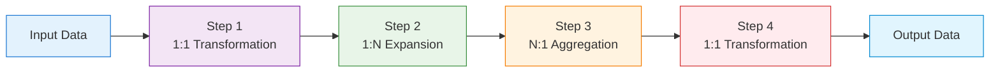
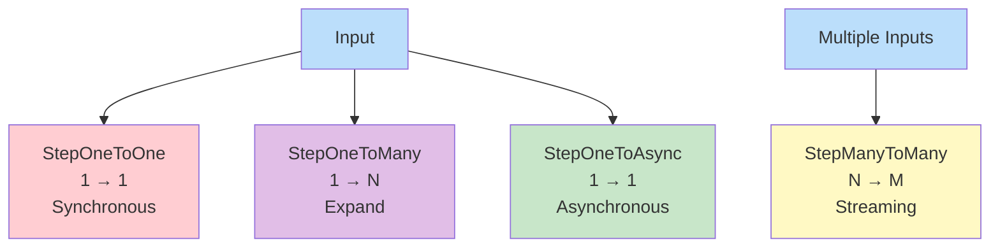

# Pipeline Framework

[](https://opensource.org/licenses/Apache-2.0)
[](https://adoptium.net/)
[](https://quarkus.io/)

A high-performance, reactive pipeline processing framework built with Quarkus, Mutiny, and Project Loom virtual threads.

## Overview

The Pipeline Framework is a powerful, reactive processing system designed for building high-throughput, resilient, and maintainable distributed systems. It provides a robust foundation for implementing complex data processing workflows with built-in features for concurrency, resilience, and observability.

## Key Features

### 🚀 High Throughput & Performance
- **Virtual Threads**: Leverages Project Loom's virtual threads for massive concurrency with minimal resource overhead
- **Non-blocking I/O**: Built on Mutiny reactive streams for efficient resource utilization
- **Optimized Execution**: Configurable concurrency limits and thread management
- **Reactive Programming Model**: Business logic services return `Uni<S>` reactive types, enabling efficient resource utilization
- **Backpressure Handling**: Seamless integration with reactive components prevents system overwhelm

### 🛡️ Resilience & Fault Tolerance
- **Automatic Retry Logic**: Exponential backoff retry mechanism with configurable attempts
- **Circuit Breaker Pattern**: Built-in failure detection and isolation
- **Graceful Degradation**: Failures in one step don't cascade to others
- **Comprehensive Error Handling**: Centralized error management with detailed logging
- **Reactive Error Handling**: Seamless integration with Mutiny's error handling capabilities

### 📈 Scalability & Flexibility
- **Independent Deployment**: Each step can be deployed, scaled, and versioned separately
- **Microservices Architecture**: Natural fit for distributed systems
- **Cardinality Flexibility**: Support for 1:1, 1:N, and N:1 transformations
- **Horizontal Scaling**: Easy to add more instances of any step
- **Flexible Persistence**: Database persistence is an optional service, not a central requirement

### 🔍 Observability & Monitoring
- **Distributed Tracing**: Full OpenTelemetry integration for end-to-end visibility
- **Metrics Collection**: Micrometer integration for performance monitoring
- **Structured Logging**: Consistent, contextual logging across all steps
- **Health Checks**: Built-in health monitoring capabilities

## Architecture

### Pipeline Concept

The framework implements a pipeline pattern where data flows through a series of processing steps:



### Core Components

1. **PipelineRunner**: The main execution engine that orchestrates the flow of data through steps
2. **Step Interfaces**: Type-safe interfaces for different processing patterns
3. **Configuration System**: Dynamic configuration management with profiles and overrides
4. **gRPC Adapters**: Components for exposing services and consuming other services
5. **Observability Layer**: Built-in metrics, tracing, and logging

### Step Cardinality Patterns

The framework supports different step interfaces based on input/output cardinality:



## Getting Started

### Prerequisites

- Java 21 or higher
- Maven 3.6+
- Quarkus CLI (optional but recommended)

### Installation

Add the pipeline framework dependency to your Maven project:

```xml
<dependency>
    <groupId>io.github.mbarcia</groupId>
    <artifactId>pipeline-framework</artifactId>
    <version>1.0</version>
</dependency>
```

### Quick Start

1. **Create a Pipeline Step**:

```java
@ApplicationScoped
public class MyProcessingStep extends ConfigurableStepBase 
    implements StepOneToOne<InputType, OutputType> {
    
    @Override
    public OutputType apply(InputType input) {
        // Your business logic here
        return processInput(input);
    }
}
```

2. **Configure the Pipeline**:

```java
PipelineConfig pipelineConfig = new PipelineConfig();
pipelineConfig.defaults().retryLimit(3).debug(false);
```

3. **Run the Pipeline**:

```java
try (PipelineRunner runner = new PipelineRunner()) {
    Multi<InputType> input = Multi.createFrom().items(/* your data */);
    List<StepBase> steps = List.of(new MyProcessingStep());
    
    Multi<Object> result = runner.run(input, steps);
    // Process results
}
```

## Documentation

- [How to Create a New Pipeline Step](docs/HOWTO_NEW_STEP.md) - Complete guide for implementing new steps
- [Pipeline Benefits](docs/PIPELINE_BENEFITS.md) - Detailed list of advantages of using the framework
- [Configuration Guide](CONFIGURATION.md) - Pipeline configuration system documentation

## Step Interfaces

The framework provides several step interfaces for different processing patterns:

### StepOneToOne<I, O>
Transforms one input into one output with synchronous processing.

### StepOneToMany<I, O>
Transforms one input into multiple outputs (data expansion).

### StepOneToAsync<I, O>
Transforms one input into one output with asynchronous processing.

### StepManyToMany
Transforms multiple inputs into multiple outputs (stream processing).

## Configuration

Steps can be configured globally or individually:

```java
// Global configuration
pipelineConfig.defaults().retryLimit(3).debug(false);

// Profile-specific configuration
pipelineConfig.profile("dev", new StepConfig().retryLimit(1).debug(true));

// Step-specific overrides
step.liveConfig().overrides().retryLimit(5).concurrency(10);
```

## Observability

The framework includes built-in observability features:

- **Metrics**: Throughput, latency, and error rate metrics
- **Tracing**: Distributed tracing with OpenTelemetry
- **Logging**: Structured, contextual logging
- **Health Checks**: Service health monitoring

## Testing

The framework includes comprehensive testing utilities:

```java
@Test
void testPipelineStep() {
    try (PipelineRunner runner = new PipelineRunner()) {
        Multi<String> input = Multi.createFrom().items("test");
        List<StepBase> steps = List.of(new MyTestStep());
        
        Multi<Object> result = runner.run(input, steps);
        // Assert results
    }
}
```

## Contributing

1. Fork the repository
2. Create a feature branch
3. Commit your changes
4. Push to the branch
5. Create a pull request

## License

This project is licensed under the Apache License 2.0 - see the [LICENSE](LICENSE) file for details.

## Acknowledgments

- [Quarkus](https://quarkus.io/) - Kubernetes-native Java framework
- [Mutiny](https://smallrye.io/smallrye-mutiny/) - Reactive programming library
- [Project Loom](https://openjdk.org/projects/loom/) - Virtual threads for Java