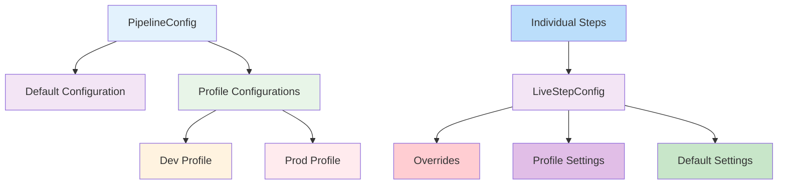

# Pipeline Framework Configuration Guide

## Overview

The pipeline framework provides a flexible configuration system that allows developers to configure steps with different settings. The configuration system is based on three main approaches:

1. **Step-level Configuration**: Using `StepConfig`, `PipelineConfig`, and `LiveStepConfig` for configuring individual pipeline steps
2. **Dynamic Configuration**: Using `@ConfigMapping` with `PipelineInitialConfig` for type-safe configuration with runtime updates
3. **ConfigurableStepBase**: Base class for steps that use the configuration system

The configuration hierarchy works as follows:



## Configuration Parameters

The following properties can be configured for each step:

### 1. retryLimit
- **Type**: int
- **Default**: 3
- **Description**: Specifies the maximum number of times a step will retry after a failure before giving up.

**Example**:
```java
myStep.liveConfig().overrides().retryLimit(5);
```

### 2. retryWait
- **Type**: Duration
- **Default**: 200ms
- **Description**: The initial delay between retry attempts.

**Example**:
```java
myStep.liveConfig().overrides().retryWait(Duration.ofSeconds(1));
```

### 3. concurrency
- **Type**: int
- **Default**: 4
- **Description**: Controls how many instances of a step can run concurrently.

**Example**:
```java
myStep.liveConfig().overrides().concurrency(10);
```

### 4. debug
- **Type**: boolean
- **Default**: false
- **Description**: Enables detailed logging for a step, useful for troubleshooting.

**Example**:
```java
myStep.liveConfig().overrides().debug(true);
```

### 5. recoverOnFailure
- **Type**: boolean
- **Default**: false
- **Description**: When enabled, allows a step to recover from failures.

**Example**:
```java
myStep.liveConfig().overrides().recoverOnFailure(true);
```

### 6. runWithVirtualThreads
- **Type**: boolean
- **Default**: false
- **Description**: When enabled, uses virtual threads for blocking operations.

**Example**:
```java
myStep.liveConfig().overrides().runWithVirtualThreads(true);
```

### 7. maxBackoff
- **Type**: Duration
- **Default**: 30s
- **Description**: The maximum delay between retry attempts when using exponential backoff.

**Example**:
```java
myStep.liveConfig().overrides().maxBackoff(Duration.ofSeconds(10));
```

### 8. jitter
- **Type**: boolean
- **Default**: false
- **Description**: When enabled, adds randomization to retry delays.

**Example**:
```java
myStep.liveConfig().overrides().jitter(true);
```

## Configuration Hierarchy

1. **Pipeline Defaults**: Set via `pipelineConfig.defaults()`
2. **Profile Configuration**: Set via `pipelineConfig.profile()`
3. **Step Overrides**: Set via `step.liveConfig().overrides()`

## Step-Level Configuration

### Create a Configurable Step

```java
@ApplicationScoped
public class MyStep extends ConfigurableStepBase implements StepOneToOne<Input, Output> {
    
    @Inject
    public MyStep(PipelineConfig pipelineConfig) {
        super(pipelineConfig);
    }
    
    @Override
    public Output apply(Input input) {
        // Your step logic here
        return output;
    }
}
```

### Configure Pipeline Defaults

```java
@Inject PipelineConfig pipelineConfig;

// In your application initialization
pipelineConfig.defaults()
    .retryLimit(5)
    .retryWait(Duration.ofSeconds(1))
    .concurrency(8)
    .debug(false);
```

### Using Configuration Profiles

```java
// Define profiles
pipelineConfig.profile("dev", new StepConfig().retryLimit(1).debug(true));
pipelineConfig.profile("prod", new StepConfig().retryLimit(5).retryWait(Duration.ofSeconds(2)));

// Activate a profile
pipelineConfig.activate("prod");
```

### Override Step Configuration

```java
@ApplicationScoped
public class MyStep extends ConfigurableStepBase implements StepOneToOne<Input, Output> {
    
    @Inject
    public MyStep(PipelineConfig pipelineConfig) {
        super(pipelineConfig);
        // Apply step-specific overrides
        liveConfig().overrides().retryLimit(5);
    }
}
```

## Dynamic Configuration with @ConfigMapping

For scenarios where you need type-safe configuration with runtime updates, the framework provides a dynamic configuration pattern.

### Configuration Interface

```java
@ConfigMapping(prefix = "csv-poc.pipeline")
public interface PipelineInitialConfig {
    @WithDefault("1000")
    Integer concurrency();

    @WithDefault("3")
    Integer retryLimit();

    @WithDefault("1000")
    Long retryWaitMs();
}
```

### Dynamic Configuration Holder

```java
@ApplicationScoped
public class PipelineDynamicConfig {
    private final AtomicReference<PipelineConfigValues> currentConfig = 
        new AtomicReference<>(new PipelineConfigValues(1000, 3, 1000L));
    
    public int getConcurrency() {
        return currentConfig.get().concurrency;
    }
    
    public int getRetryLimit() {
        return currentConfig.get().retryLimit;
    }
    
    public long getRetryWait() {
        return currentConfig.get().retryWaitMs;
    }
    
    public void updateConfig(int concurrency, int retryLimit, long retryWaitMs) {
        currentConfig.set(new PipelineConfigValues(concurrency, retryLimit, retryWaitMs));
    }
    
    public void updateConfig(PipelineInitialConfig staticConfig) {
        updateConfig(
            staticConfig.concurrency(), 
            staticConfig.retryLimit(), 
            staticConfig.retryWaitMs()
        );
    }
}
```

## Configuration Examples

### Environment-Specific Configuration

```java
@Inject PipelineConfig pipelineConfig;
@Inject PipelineDynamicConfig dynamicConfig;

@PostConstruct
void init() {
    // Development profile
    pipelineConfig.profile("dev", new StepConfig()
        .retryLimit(1)
        .debug(true)
        .concurrency(2));
    
    // Production profile
    pipelineConfig.profile("prod", new StepConfig()
        .retryLimit(5)
        .retryWait(Duration.ofSeconds(1))
        .concurrency(20)
        .debug(false)
        .maxBackoff(Duration.ofMinutes(5))
        .jitter(true));
    
    // Activate appropriate profile based on environment
    String env = System.getenv("ENVIRONMENT");
    pipelineConfig.activate(env != null ? env : "dev");
    
    // Configure individual steps based on their characteristics
    processInputFileStep.liveConfig().overrides()
        .concurrency(50)
        .retryLimit(3)
        .runWithVirtualThreads(true);
}
```

### Using Environment Variables

```yaml
services:
  orchestrator-svc:
    environment:
      - PIPELINE_RETRY_LIMIT=5
      - PIPELINE_CONCURRENCY=8
      - PROCESS_INPUT_FILE_CONCURRENCY=50
```

```java
@PostConstruct
void init() {
    // Read global defaults from environment
    String retryLimit = System.getenv("PIPELINE_RETRY_LIMIT");
    String concurrency = System.getenv("PIPELINE_CONCURRENCY");
    
    if (retryLimit != null) {
        pipelineConfig.defaults().retryLimit(Integer.parseInt(retryLimit));
    }
    
    if (concurrency != null) {
        pipelineConfig.defaults().concurrency(Integer.parseInt(concurrency));
    }
    
    // Configure individual steps based on environment variables
    String inputFileConcurrency = System.getenv("PROCESS_INPUT_FILE_CONCURRENCY");
    if (inputFileConcurrency != null) {
        processInputFileStep.liveConfig().overrides()
            .concurrency(Integer.parseInt(inputFileConcurrency));
    }
}
```

### Using Application Properties

```properties
# In application.properties
pipeline.retry-limit=5
pipeline.concurrency=8
pipeline.debug=false

# Step-specific properties
process.input.file.concurrency=50
```

```java
@ConfigProperty(name = "pipeline.retry-limit", defaultValue = "3")
int defaultRetryLimit;

@ConfigProperty(name = "process.input.file.concurrency", defaultValue = "4")
int inputFileConcurrency;

@Inject PipelineConfig pipelineConfig;
@Inject PipelineInitialConfig staticConfig;
@Inject PipelineDynamicConfig dynamicConfig;

@PostConstruct
void init() {
    // Configure defaults
    pipelineConfig.defaults()
        .retryLimit(defaultRetryLimit)
        .concurrency(inputFileConcurrency)
        .debug(false);
    
    // Initialize dynamic configuration from static config
    dynamicConfig.updateConfig(staticConfig);
}
```

## Best Practices

1. **Use profiles**: Define different configuration profiles for different environments
2. **Step-specific configuration**: Use `liveConfig().overrides()` to configure individual steps differently
3. **Environment-specific configuration**: Use environment variables or application properties for environment-specific settings
4. **Monitor performance**: Adjust concurrency levels based on performance monitoring

## Profile Management

The configuration system automatically detects the Quarkus profile and activates the corresponding configuration. You can also manually activate profiles:

```java
pipelineConfig.activate("dev");
```

## Hot Reload

Configuration changes are applied dynamically without restarting the application, thanks to the atomic references used in the configuration classes.