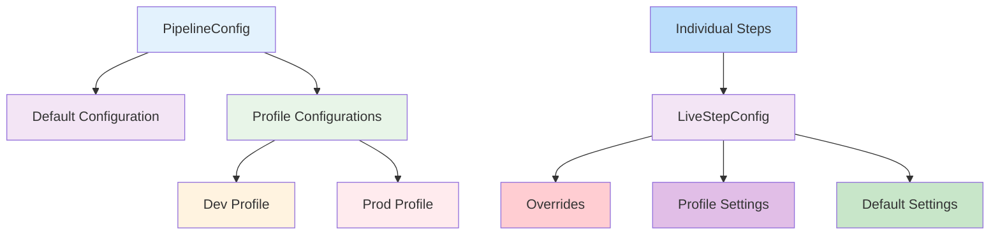

# Pipeline Framework Configuration Guide

## Overview

The pipeline framework provides a flexible configuration system that allows developers to configure steps with different settings. The configuration system is based on three main approaches:

1. **Step-level Configuration**: Using `StepConfig`, `PipelineConfig`, and `LiveStepConfig` for configuring individual pipeline steps
2. **Dynamic Configuration**: Using `@ConfigMapping` with `PipelineInitialConfig` for type-safe configuration with runtime updates
3. **ConfigurableStepBase**: Base class for steps that use the configuration system

The configuration hierarchy works as follows:



## Configuration Parameters

The following properties can be configured for each step:

### 1. retryLimit
- **Type**: int
- **Default**: 3
- **Description**: Specifies the maximum number of times a step will retry after a failure before giving up.
- **Usage**: Used in all step types (StepOneToOne, StepOneToMany, StepManyToMany, StepOneToAsync) for failure recovery.

**Practical Examples**:
```java
// For a step that calls an external API that might be temporarily unavailable
myStep.liveConfig().overrides().retryLimit(5);

// For a step that processes critical data and should retry extensively
criticalStep.liveConfig().overrides().retryLimit(10);
```

**Things to Avoid**:
- Setting extremely high retry limits without considering the impact on overall processing time
- Not considering circuit breaker patterns for persistent failures

### 2. retryWait
- **Type**: Duration
- **Default**: 200ms
- **Description**: The initial delay between retry attempts. This delay can be modified by exponential backoff.
- **Usage**: Used with Mutiny's retry mechanism to control timing between retries.

**Practical Examples**:
```java
// For a step calling a rate-limited API, start with a longer delay
rateLimitedStep.liveConfig().overrides().retryWait(Duration.ofSeconds(1));

// For a step that needs quick retries for transient issues
quickRetryStep.liveConfig().overrides().retryWait(Duration.ofMillis(50));
```

**Things to Avoid**:
- Setting retry delays too short, which might overwhelm downstream services
- Setting retry delays too long, which might cause unnecessary processing delays

### 3. concurrency
- **Type**: int
- **Default**: 4
- **Description**: Controls how many instances of a step can run concurrently.
- **Usage**: Used in StepOneToMany and StepManyToMany to control parallelism.

**Practical Examples**:
```java
// High concurrency for I/O bound operations
processInputFileStep.liveConfig().overrides().concurrency(50);

// Low concurrency for CPU-intensive operations
cpuIntensiveStep.liveConfig().overrides().concurrency(2);

// Sequential processing for order-dependent operations
sequentialStep.liveConfig().overrides().concurrency(1);
```

**Things to Avoid**:
- Setting concurrency too high, which might overwhelm system resources or downstream services
- Setting concurrency too low, which might underutilize available resources

### 4. debug
- **Type**: boolean
- **Default**: false
- **Description**: Enables detailed logging for a step, useful for troubleshooting.
- **Usage**: Controls debug logging throughout all step types.

**Practical Examples**:
```java
// Enable debugging in development environment
myStep.liveConfig().overrides().debug(true);

// Enable debugging for a specific step that's having issues
troubleshootingStep.liveConfig().overrides().debug(true);
```

**Things to Avoid**:
- Leaving debug enabled in production environments as it can impact performance
- Relying on debug logs for production monitoring instead of proper observability tools

### 5. recoverOnFailure
- **Type**: boolean
- **Default**: false
- **Description**: When enabled, allows a step to recover from failures by passing through the original item or implementing custom dead letter handling.
- **Usage**: Used in failure recovery mechanisms across all step types.

**Practical Examples**:
```java
// For non-critical steps where failure shouldn't stop the pipeline
notificationStep.liveConfig().overrides().recoverOnFailure(true);

// For steps where you want to implement custom dead letter handling
paymentStep.liveConfig().overrides().recoverOnFailure(true);
```

**Things to Avoid**:
- Enabling recovery for critical steps where failure should halt processing
- Not implementing proper dead letter handling when recovery is enabled

### 6. runWithVirtualThreads
- **Type**: boolean
- **Default**: false
- **Description**: When enabled, uses virtual threads (Java 21+) for blocking operations, improving resource efficiency.
- **Usage**: Used in StepOneToMany and StepManyToMany to control execution context.

**Practical Examples**:
```java
// For I/O bound operations that benefit from virtual threads
blockingIoStep.liveConfig().overrides().runWithVirtualThreads(true);

// For steps that work with blocking APIs
databaseStep.liveConfig().overrides().runWithVirtualThreads(true);
```

**Things to Avoid**:
- Using virtual threads with CPU-intensive operations
- Enabling virtual threads in environments that don't support them

### 7. useExponentialBackoff
- **Type**: boolean
- **Default**: false
- **Description**: When enabled, increases the delay between retry attempts exponentially.
- **Usage**: Works with retryWait and maxBackoff to control retry timing.

**Practical Examples**:
```java
// For steps calling external services that might be temporarily overloaded
externalApiStep.liveConfig().overrides()
    .useExponentialBackoff(true)
    .retryLimit(5)
    .retryWait(Duration.ofSeconds(1))
    .maxBackoff(Duration.ofMinutes(5));
```

**Things to Avoid**:
- Using exponential backoff with very short maxBackoff values
- Not considering the total time impact of exponential backoff on processing deadlines

### 8. maxBackoff
- **Type**: Duration
- **Default**: 30s
- **Description**: The maximum delay between retry attempts when using exponential backoff.
- **Usage**: Caps the retry delay in exponential backoff scenarios.

**Practical Examples**:
```java
// For critical operations that should retry frequently but not too aggressively
criticalStep.liveConfig().overrides()
    .useExponentialBackoff(true)
    .maxBackoff(Duration.ofSeconds(10));

// For less critical operations that can afford longer delays between retries
backgroundStep.liveConfig().overrides()
    .useExponentialBackoff(true)
    .maxBackoff(Duration.ofMinutes(10));
```

**Things to Avoid**:
- Setting maxBackoff too low, which reduces the effectiveness of exponential backoff
- Setting maxBackoff too high, which might cause unacceptable delays

### 9. jitter
- **Type**: boolean
- **Default**: false
- **Description**: When enabled, adds randomization to retry delays to prevent thundering herd problems.
- **Usage**: Works with retry mechanisms to add randomness to delay calculations.

**Practical Examples**:
```java
// For steps calling shared services to prevent synchronized retries
sharedServiceStep.liveConfig().overrides()
    .jitter(true)
    .useExponentialBackoff(true);
```

**Things to Avoid**:
- Using jitter without exponential backoff, as it has less benefit
- Enabling jitter for steps that require deterministic retry timing

## Step-Level Configuration

### How to Configure Steps

#### 1. Create a Configurable Step

Extend `ConfigurableStepBase` and inject `PipelineConfig`:

```java
@ApplicationScoped
public class MyStep extends ConfigurableStepBase implements StepOneToOne<Input, Output> {
    
    @Inject
    public MyStep(PipelineConfig pipelineConfig) {
        super(pipelineConfig);
    }
    
    @Override
    public Output apply(Input input) {
        // Your step logic here
        return output;
    }
}
```

#### 2. Configure Pipeline Defaults

In your main application, configure the pipeline defaults:

```java
@Inject PipelineConfig pipelineConfig;

// In your application initialization
pipelineConfig.defaults()
    .retryLimit(5)
    .retryWait(Duration.ofSeconds(1))
    .concurrency(8)
    .debug(false);
```

#### 3. Using Configuration Profiles

You can define different profiles for different environments:

```java
// Define profiles
pipelineConfig.profile("dev", new StepConfig().retryLimit(1).debug(true));
pipelineConfig.profile("prod", new StepConfig().retryLimit(5).retryWait(Duration.ofSeconds(2)));

// Activate a profile
pipelineConfig.activate("prod");
```

#### 4. Override Step Configuration (Optional)

If you need step-specific overrides, you can access the live configuration:

```java
@ApplicationScoped
public class MyStep extends ConfigurableStepBase implements StepOneToOne<Input, Output> {
    
    @Inject
    public MyStep(PipelineConfig pipelineConfig) {
        super(pipelineConfig);
        // Apply step-specific overrides
        liveConfig().overrides().retryLimit(5);
    }
    
    // ...
}
```

## Configuration Hierarchy and Best Practices

### Configuration Hierarchy
1. **Pipeline Defaults**: Set via `pipelineConfig.defaults()`
2. **Profile Configuration**: Set via `pipelineConfig.profile()`
3. **Step Overrides**: Set via `step.liveConfig().overrides()`

### Bad Interactions and Anti-Patterns

1. **High Concurrency + Low Retry Limits**: Can overwhelm downstream services without adequate retry protection
2. **Exponential Backoff + Low MaxBackoff**: Reduces the effectiveness of backoff strategy
3. **High Concurrency + Virtual Threads Disabled**: May not fully utilize system resources for I/O bound operations
4. **Recovery Enabled + No Dead Letter Handling**: Can lead to silent data loss
5. **Debug Enabled + High Concurrency**: Can generate excessive log volume and impact performance

### Practical Configuration Examples

#### Example 1: Environment-Specific Configuration
```java
@Inject PipelineConfig pipelineConfig;

@PostConstruct
void init() {
    // Development profile
    pipelineConfig.profile("dev", new StepConfig()
        .retryLimit(1)
        .debug(true)
        .concurrency(2));
    
    // Production profile
    pipelineConfig.profile("prod", new StepConfig()
        .retryLimit(5)
        .retryWait(Duration.ofSeconds(1))
        .concurrency(20)
        .debug(false)
        .useExponentialBackoff(true)
        .maxBackoff(Duration.ofMinutes(5))
        .jitter(true));
    
    // Activate appropriate profile based on environment
    String env = System.getenv("ENVIRONMENT");
    pipelineConfig.activate(env != null ? env : "dev");
}
```

#### Example 2: Step-Specific Configuration
```java
// Configure individual steps based on their characteristics
processInputFileStep.liveConfig().overrides()
    .concurrency(50)  // High concurrency for I/O bound operation
    .retryLimit(3)
    .runWithVirtualThreads(true);  // Use virtual threads for blocking I/O

persistAndSendPaymentStep.liveConfig().overrides()
    .concurrency(10)  // Moderate concurrency for database operations
    .retryLimit(5)
    .useExponentialBackoff(true)
    .maxBackoff(Duration.ofMinutes(2))
    .jitter(true)
    .recoverOnFailure(true);  // Important step with recovery mechanism

generateReportStep.liveConfig().overrides()
    .concurrency(1)  // Sequential processing for report generation
    .retryLimit(2);
```

## Dynamic Configuration with @ConfigMapping

For scenarios where you need type-safe configuration with runtime updates and the ability to alter config values without breaking the FunctionalInterface contract, the framework provides a dynamic configuration pattern.

**Note**: The dynamic configuration system uses different parameter names than the core StepConfig:
- `concurrencyLimitRecords` maps to `concurrency`
- `maxRetries` maps to `retryLimit`
- `initialRetryDelay` maps to `retryWait`

### Configuration Interface

```java
@ConfigMapping(prefix = "csv-poc.pipeline")
public interface PipelineInitialConfig {
    @WithDefault("1000")
    Integer concurrencyLimitRecords();

    @WithDefault("3")
    Integer maxRetries();

    @WithDefault("1000")
    Long initialRetryDelay();
    
    // All other configuration properties with defaults...
}
```

### Dynamic Configuration Holder

```java
@ApplicationScoped
public class PipelineDynamicConfig {
    private final AtomicReference<PipelineConfigValues> currentConfig = 
        new AtomicReference<>(new PipelineConfigValues(1000, 3, 1000L));
    
    public int getConcurrencyLimitRecords() {
        return currentConfig.get().concurrencyLimitRecords;
    }
    
    public int getMaxRetries() {
        return currentConfig.get().maxRetries;
    }
    
    public long getInitialRetryDelay() {
        return currentConfig.get().initialRetryDelay;
    }
    
    // Methods for all other configuration properties...
    
    public void updateConfig(int concurrencyLimitRecords, int maxRetries, long initialRetryDelay) {
        currentConfig.set(new PipelineConfigValues(concurrencyLimitRecords, maxRetries, initialRetryDelay));
    }
    
    public void updateConfig(PipelineInitialConfig staticConfig) {
        updateConfig(
            staticConfig.concurrencyLimitRecords(), 
            staticConfig.maxRetries(), 
            staticConfig.initialRetryDelay()
        );
    }
}
```

### Usage in Service Classes

Service classes implementing a FunctionalInterface can use the dynamic configuration:

```java
@ApplicationScoped
public class MyService {
    @Inject
    PipelineDynamicConfig dynamicConfig;
    
    public void process() {
        int concurrency = dynamicConfig.getConcurrencyLimitRecords();
        int maxRetries = dynamicConfig.getMaxRetries();
        long retryDelay = dynamicConfig.getInitialRetryDelay();
        
        // Use these values in your processing logic
        // The configuration can be updated at runtime without changing the method signature
    }
}
```

### Runtime Configuration Updates

The configuration can be updated at runtime:

```java
@Inject
PipelineDynamicConfig dynamicConfig;

// Update configuration at runtime
dynamicConfig.updateConfig(2000, 5, 500L);
```

## Configuration Examples

### 1. Configuring Individual Steps with Different Concurrency

You can configure individual steps with different concurrency levels:

```java
// For a step that needs high concurrency
ProcessInputFileStep processInputFileStep = new ProcessInputFileStep(pipelineConfig);
processInputFileStep.liveConfig().overrides().concurrency(50);

// For a step that should be sequential
ProcessPaymentStatusStep processPaymentStatusStep = new ProcessPaymentStatusStep(pipelineConfig);
processPaymentStatusStep.liveConfig().overrides().concurrency(1);

// For a step with moderate concurrency
PersistAndSendPaymentStep persistAndSendPaymentStep = new PersistAndSendPaymentStep(pipelineConfig);
persistAndSendPaymentStep.liveConfig().overrides().concurrency(10);
```

### 2. Using Environment Variables for Configuration

You can also configure steps using environment variables in your `docker-compose.yml`:

```yaml
services:
  orchestrator-svc:
    environment:
      # Global settings
      - PIPELINE_RETRY_LIMIT=5
      - PIPELINE_CONCURRENCY=8
      # Step-specific settings
      - PROCESS_INPUT_FILE_CONCURRENCY=50
      - PROCESS_PAYMENT_STATUS_CONCURRENCY=1
      # Pipeline settings
      - CSV_POC_PIPELINE_CONCURRENCY_LIMIT_RECORDS=2000
      - CSV_POC_PIPELINE_MAX_RETRIES=10
      - CSV_POC_PIPELINE_INITIAL_RETRY_DELAY=500
```

Then in your application code, read these values:

```java
@Inject PipelineConfig pipelineConfig;
@Inject PipelineDynamicConfig dynamicConfig;

@PostConstruct
void init() {
    // Read global defaults from environment
    String retryLimit = System.getenv("PIPELINE_RETRY_LIMIT");
    String concurrency = System.getenv("PIPELINE_CONCURRENCY");
    
    if (retryLimit != null) {
        pipelineConfig.defaults().retryLimit(Integer.parseInt(retryLimit));
    }
    
    if (concurrency != null) {
        pipelineConfig.defaults().concurrency(Integer.parseInt(concurrency));
    }
    
    // Configure individual steps based on environment variables
    String inputFileConcurrency = System.getenv("PROCESS_INPUT_FILE_CONCURRENCY");
    if (inputFileConcurrency != null) {
        processInputFileStep.liveConfig().overrides()
            .concurrency(Integer.parseInt(inputFileConcurrency));
    }
    
    // Update dynamic configuration from environment
    String concurrencyLimitRecords = System.getenv("CSV_POC_PIPELINE_CONCURRENCY_LIMIT_RECORDS");
    String maxRetries = System.getenv("CSV_POC_PIPELINE_MAX_RETRIES");
    String initialRetryDelay = System.getenv("CSV_POC_PIPELINE_INITIAL_RETRY_DELAY");
    
    if (concurrencyLimitRecords != null && maxRetries != null && initialRetryDelay != null) {
        dynamicConfig.updateConfig(
            Integer.parseInt(concurrencyLimitRecords),
            Integer.parseInt(maxRetries),
            Long.parseLong(initialRetryDelay)
        );
    }
}
```

### 3. Using Application Properties

You can also use Quarkus application properties:

```properties
# In application.properties
pipeline.retry-limit=5
pipeline.concurrency=8
pipeline.debug=false

# Step-specific properties
process.input.file.concurrency=50
process.payment.status.concurrency=1

# Pipeline properties
csv-poc.pipeline.concurrency-limit-records=2000
csv-poc.pipeline.max-retries=10
csv-poc.pipeline.initial-retry-delay=500
```

Then in your application:

```java
@ConfigProperty(name = "pipeline.retry-limit", defaultValue = "3")
int defaultRetryLimit;

@ConfigProperty(name = "process.input.file.concurrency", defaultValue = "4")
int inputFileConcurrency;

@Inject PipelineConfig pipelineConfig;
@Inject PipelineInitialConfig staticConfig;
@Inject PipelineDynamicConfig dynamicConfig;

@PostConstruct
void init() {
    // Configure defaults
    pipelineConfig.defaults()
        .retryLimit(defaultRetryLimit)
        .concurrency(defaultConcurrency)
        .debug(defaultDebug);
    
    // Configure step-specific settings
    processInputFileStep.liveConfig().overrides()
        .concurrency(inputFileConcurrency);
    
    // Initialize dynamic configuration from static config
    dynamicConfig.updateConfig(staticConfig);
}
```

## Profile Management

The configuration system automatically detects the Quarkus profile and activates the corresponding configuration. You can also manually activate profiles:

```java
pipelineConfig.activate("dev");
```

## Hot Reload

Configuration changes are applied dynamically without restarting the application, thanks to the atomic references used in the configuration classes.

## Best Practices

1. **Use profiles**: Define different configuration profiles for dev, test, and production environments
2. **Step-specific configuration**: Use `liveConfig().overrides()` to configure individual steps differently
3. **Environment-specific configuration**: Use environment variables or application properties for environment-specific settings
4. **Document your configuration**: Add comments explaining why certain steps need different concurrency levels
5. **Monitor performance**: Adjust concurrency levels based on performance monitoring and resource usage
6. **Use dynamic configuration for runtime updates**: When you need to alter config values at runtime without breaking interfaces, use the `@ConfigMapping` pattern with dynamic config holder

## Monitoring and Observability

When configuring steps, consider how the configuration affects observability:
- Higher concurrency can make tracing more complex
- Debug logging should be used judiciously in production
- Retry mechanisms should be monitored to detect persistent failures
- Recovery mechanisms should log or track dead letter items for analysis