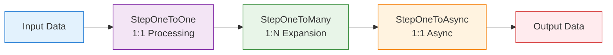

# How to Create a New Pipeline Step

This document explains how to create a new step for the pipeline framework. The pipeline framework is designed to provide a robust, scalable, and maintainable way to process data through a series of steps with built-in benefits for high-throughput, distributed systems.

## Understanding the Pipeline Framework

The pipeline framework is built around several key concepts that enable high-performance, resilient, and maintainable distributed systems:

1. **Step-based Processing**: Each business logic operation is encapsulated in a step that implements a specific interface.
2. **Reactive Programming**: Steps use Mutiny reactive streams for non-blocking I/O operations.
3. **Type Safety**: Steps are strongly typed with clear input and output types that chain together.
4. **Configuration Management**: Steps can be configured globally or individually for retry logic, concurrency, and more.
5. **Observability**: Built-in metrics, tracing, and logging for monitoring and debugging.

## Key Design Decisions

### 1. Choosing the Right Step Interface

The pipeline framework provides several step interfaces that match different types of business logic processing:

- **`StepOneToOne<I, O>`**: Transforms one input into one output (1:1) - synchronous processing
- **`StepOneToMany<I, O>`**: Transforms one input into multiple outputs (1:N) - expands data
- **`StepOneToAsync<I, O>`**: Transforms one input into one output (1:1) - asynchronous processing
- **`StepManyToMany`**: Transforms multiple inputs into multiple outputs (N:M) - stream processing

**Important**: The output type of one step becomes the input type of the next step. This creates a strongly-typed pipeline where data flows from one step to the next.

Here's how data flows through a pipeline with different step types:



### 2. Immutability and Data Flow

Steps work with immutable data objects. There are no in-place updates (no SQL UPDATE commands), which eliminates concurrency issues and race conditions. When data needs to be preserved across steps, it must be explicitly carried forward.

### 3. Persistence as an Optional Service

Database persistence is an optional service, not a central requirement. Any step can query the database for information if needed, but carrying data forward explicitly is often more efficient.

## Project Structure

Your project will need to have:
- A common package (as a Maven submodule) for shared entities, DTOs, and mappers
- Step packages (as Maven submodules) for each pipeline step
- A parent POM and docker-compose.yaml
- Optionally, TLS certificates

The common module will hold all your entities/dtos and mappers. Also, your .proto definitions for your services. Each RPC service detailed there will probably be a step of the pipeline.

Then for each step, you will have to write a Maven submodule with:
- An implementation of a step interface (this is your actual business logic)
- A gRPC wrapper of that service using `GrpcReactiveServiceAdapter`
- An `application.properties` file
- An optional REST resource class if you want to expose it also to a REST API

## Creating a New Step

### Step 1: Choose the Appropriate Step Interface

Choose the step interface that matches your business logic:

```java
// For 1:1 transformation with synchronous processing
@ApplicationScoped
public class MyProcessingStep extends ConfigurableStepBase implements StepOneToOne<InputType, OutputType> {
    
    @Override
    public OutputType apply(InputType input) {
        // Your business logic here
        return processInput(input);
    }
    
    private OutputType processInput(InputType input) {
        // Implementation
        return new OutputType(input.getValue());
    }
}

// For 1:N transformation
@ApplicationScoped
public class MyExpandingStep extends ConfigurableStepBase implements StepOneToMany<InputType, OutputType> {
    
    @Override
    public Multi<OutputType> applyMulti(InputType input) {
        // Your business logic here
        return Multi.createFrom().items(createMultipleOutputs(input));
    }
    
    private OutputType[] createMultipleOutputs(InputType input) {
        // Implementation that creates multiple outputs
        return new OutputType[] { /* ... */ };
    }
}

// For async processing
@ApplicationScoped
public class MyAsyncStep extends ConfigurableStepBase implements StepOneToAsync<InputType, OutputType> {
    
    @Override
    public Uni<OutputType> applyAsyncUni(InputType input) {
        // Your async business logic here
        return performAsyncOperation(input);
    }
    
    private Uni<OutputType> performAsyncOperation(InputType input) {
        // Implementation with Uni
        return Uni.createFrom().item(processInput(input));
    }
}
```

### Step 2: Implement Your Business Logic

Focus on your business requirements without worrying about pipeline concerns. The framework handles retries, logging, metrics, and other cross-cutting concerns.

```java
@ApplicationScoped
public class PaymentValidationStep extends ConfigurableStepBase 
    implements StepOneToOne<PaymentRequest, ValidatedPayment> {
    
    private static final Logger LOG = LoggerFactory.getLogger(PaymentValidationStep.class);
    
    @Inject
    PaymentValidationService validationService;
    
    @Override
    public ValidatedPayment apply(PaymentRequest request) {
        LOG.debug("Validating payment: {}", request.getId());
        
        ValidationResult result = validationService.validate(request);
        
        LOG.debug("Payment validated: {}", request.getId());
        return new ValidatedPayment(request, result.isValid());
    }
}
```

### Step 3: Configure Execution Properties (Optional)

Steps automatically benefit from the pipeline's built-in features like retries, virtual threads, and observability. You can customize these behaviors by overriding the configuration:

```java
@ApplicationScoped
public class MyConfigurableStep extends ConfigurableStepBase 
    implements StepOneToOne<InputType, OutputType> {
    
    public MyConfigurableStep(PipelineConfig pipelineConfig) {
        super(pipelineConfig);
        
        // Apply step-specific overrides
        liveConfig().overrides()
            .retryLimit(5)
            .retryWait(Duration.ofSeconds(1))
            .concurrency(10)
            .debug(true);
    }
    
    @Override
    public OutputType apply(InputType input) {
        // Your business logic here
        return process(input);
    }
}
```

## Exposing Services Through gRPC and REST

### gRPC Exposure

To expose your service through gRPC, create a service class that extends the generated gRPC service base class:

```java
@GrpcService
public class YourGrpcService extends MutinyYourServiceGrpc.YourServiceImplBase {

    @Inject YourReactiveService domainService;
    @Inject YourMapper mapper;

    private final GrpcReactiveServiceAdapter<YourGrpcRequest, YourGrpcResponse, YourDomainIn, YourDomainOut> adapter =
            new GrpcReactiveServiceAdapter<>() {
                @Override
                protected ReactiveService<YourDomainIn, YourDomainOut> getService() {
                    return domainService;
                }

                @Override
                protected YourDomainIn fromGrpc(YourGrpcRequest grpcIn) {
                    return mapper.fromGrpc(grpcIn);
                }

                @Override
                protected YourGrpcResponse toGrpc(YourDomainOut domainOut) {
                    return mapper.toGrpc(domainOut);
                }
            };

    @Override
    public Uni<YourGrpcResponse> process(YourGrpcRequest request) {
        return adapter.remoteProcess(request);
    }
}
```

### REST Exposure

To expose your service through REST, create a JAX-RS resource class:

```java
@Path("/your-service")
public class YourResource {

  @Inject YourReactiveService yourService;

  @POST
  @Path("/process")
  @Consumes(MediaType.APPLICATION_JSON)
  @Produces(MediaType.APPLICATION_JSON)
  public Uni<Response> process(YourRequestDto request) {
    try {
      return yourService.process(request.toDomain())
          .onItem().transform(domainResult -> Response.ok().entity(YourResponseDto.fromDomain(domainResult)).build())
          .onFailure().recoverWithItem(e -> {
            return Response.status(Response.Status.INTERNAL_SERVER_ERROR)
                .entity(new ErrorResponse("Processing failed: " + e.getMessage())).build();
          });
    } catch (Exception e) {
      return Uni.createFrom().item(
          Response.status(Response.Status.INTERNAL_SERVER_ERROR)
              .entity(new ErrorResponse("Processing failed: " + e.getMessage())).build());
    }
  }
}
```

## Client-Side Orchestration

To orchestrate steps on the client side, use the `PipelineRunner`:

```java
public Uni<Void> process(String csvFolderPath) throws URISyntaxException {
    // Create a list of steps to execute
    List<StepBase> steps = List.of(
        new ValidatePaymentStep(),
        new ProcessPaymentStep(),
        new GenerateReceiptStep()
    );
    
    // Create input stream
    Multi<PaymentRequest> input = createPaymentRequests(csvFolderPath);
    
    // Run the pipeline
    PipelineRunner runner = new PipelineRunner();
    Multi<Object> result = runner.run(input, steps);
    
    // Process the results
    return result.collect().asList()
        .onItem().transformToUni(list -> Uni.createFrom().voidItem());
}
```

## Configuration

Steps can be configured using the pipeline configuration system. See [Configuration Guide](CONFIGURATION_CONSOLIDATED.md) for detailed information on how to configure steps with profiles, defaults, and overrides.

Each step automatically benefits from:
- Virtual thread execution
- Retry logic (3 attempts by default)
- Structured logging
- Error handling
- Metrics collection
- Distributed tracing

All without any additional code in your business logic.

## Best Practices

1. **Choose the right interface**: Match the step interface to your business logic's input/output cardinality
2. **Keep steps focused**: Each step should have a single responsibility
3. **Make data explicit**: Pass all needed data between steps explicitly rather than relying on database queries
4. **Handle errors gracefully**: Use Mutiny's error handling capabilities
5. **Use configuration**: Leverage the built-in configuration system for tuning behavior
6. **Test thoroughly**: Write unit tests for your business logic and integration tests for step interactions

## Project Structure

Your project will need to have:
- A common package (as a Maven submodule) for shared entities, DTOs, and mappers
- Step packages (as Maven submodules) for each pipeline step
- A parent POM and docker-compose.yaml
- Optionally, TLS certificates

The common module will hold all your entities/dtos and mappers. Also, your .proto definitions for your services. Each RPC service detailed there will probably be a step of the pipeline.

Then for each step, you will have to write a Maven submodule with:
- An implementation of a step interface (this is your actual business logic)
- A gRPC wrapper of that service using `GrpcReactiveServiceAdapter`
- An `application.properties` file
- An optional REST resource class if you want to expose it also to a REST API

## Creating a New Step

### Step 1: Choose the Appropriate Step Interface

Choose the step interface that matches your business logic:

```java
// For 1:1 transformation with synchronous processing
@ApplicationScoped
public class MyProcessingStep extends ConfigurableStepBase implements StepOneToOne<InputType, OutputType> {
    
    @Override
    public OutputType apply(InputType input) {
        // Your business logic here
        return processInput(input);
    }
    
    private OutputType processInput(InputType input) {
        // Implementation
        return new OutputType(input.getValue());
    }
}

// For 1:N transformation
@ApplicationScoped
public class MyExpandingStep extends ConfigurableStepBase implements StepOneToMany<InputType, OutputType> {
    
    @Override
    public Multi<OutputType> applyMulti(InputType input) {
        // Your business logic here
        return Multi.createFrom().items(createMultipleOutputs(input));
    }
    
    private OutputType[] createMultipleOutputs(InputType input) {
        // Implementation that creates multiple outputs
        return new OutputType[] { /* ... */ };
    }
}

// For async processing
@ApplicationScoped
public class MyAsyncStep extends ConfigurableStepBase implements StepOneToAsync<InputType, OutputType> {
    
    @Override
    public Uni<OutputType> applyAsyncUni(InputType input) {
        // Your async business logic here
        return performAsyncOperation(input);
    }
    
    private Uni<OutputType> performAsyncOperation(InputType input) {
        // Implementation with Uni
        return Uni.createFrom().item(processInput(input));
    }
}
```

### Step 2: Implement Your Business Logic

Focus on your business requirements without worrying about pipeline concerns. The framework handles retries, logging, metrics, and other cross-cutting concerns.

```java
@ApplicationScoped
public class PaymentValidationStep extends ConfigurableStepBase 
    implements StepOneToOne<PaymentRequest, ValidatedPayment> {
    
    private static final Logger LOG = LoggerFactory.getLogger(PaymentValidationStep.class);
    
    @Inject
    PaymentValidationService validationService;
    
    @Override
    public ValidatedPayment apply(PaymentRequest request) {
        LOG.debug("Validating payment: {}", request.getId());
        
        ValidationResult result = validationService.validate(request);
        
        LOG.debug("Payment validated: {}", request.getId());
        return new ValidatedPayment(request, result.isValid());
    }
}
```

### Step 3: Configure Execution Properties (Optional)

Steps automatically benefit from the pipeline's built-in features like retries, virtual threads, and observability. You can customize these behaviors by overriding the configuration:

```java
@ApplicationScoped
public class MyConfigurableStep extends ConfigurableStepBase 
    implements StepOneToOne<InputType, OutputType> {
    
    public MyConfigurableStep(PipelineConfig pipelineConfig) {
        super(pipelineConfig);
        
        // Apply step-specific overrides
        liveConfig().overrides()
            .retryLimit(5)
            .retryWait(Duration.ofSeconds(1))
            .concurrency(10)
            .debug(true);
    }
    
    @Override
    public OutputType apply(InputType input) {
        // Your business logic here
        return process(input);
    }
}
```

## Exposing Services Through gRPC and REST

### gRPC Exposure

To expose your service through gRPC, create a service class that extends the generated gRPC service base class:

```java
@GrpcService
public class YourGrpcService extends MutinyYourServiceGrpc.YourServiceImplBase {

    @Inject YourReactiveService domainService;
    @Inject YourMapper mapper;

    private final GrpcReactiveServiceAdapter<YourGrpcRequest, YourGrpcResponse, YourDomainIn, YourDomainOut> adapter =
            new GrpcReactiveServiceAdapter<>() {
                @Override
                protected ReactiveService<YourDomainIn, YourDomainOut> getService() {
                    return domainService;
                }

                @Override
                protected YourDomainIn fromGrpc(YourGrpcRequest grpcIn) {
                    return mapper.fromGrpc(grpcIn);
                }

                @Override
                protected YourGrpcResponse toGrpc(YourDomainOut domainOut) {
                    return mapper.toGrpc(domainOut);
                }
            };

    @Override
    public Uni<YourGrpcResponse> process(YourGrpcRequest request) {
        return adapter.remoteProcess(request);
    }
}
```

### REST Exposure

To expose your service through REST, create a JAX-RS resource class:

```java
@Path("/your-service")
public class YourResource {

  @Inject YourReactiveService yourService;

  @POST
  @Path("/process")
  @Consumes(MediaType.APPLICATION_JSON)
  @Produces(MediaType.APPLICATION_JSON)
  public Uni<Response> process(YourRequestDto request) {
    try {
      return yourService.process(request.toDomain())
          .onItem().transform(domainResult -> Response.ok().entity(YourResponseDto.fromDomain(domainResult)).build())
          .onFailure().recoverWithItem(e -> {
            return Response.status(Response.Status.INTERNAL_SERVER_ERROR)
                .entity(new ErrorResponse("Processing failed: " + e.getMessage())).build();
          });
    } catch (Exception e) {
      return Uni.createFrom().item(
          Response.status(Response.Status.INTERNAL_SERVER_ERROR)
              .entity(new ErrorResponse("Processing failed: " + e.getMessage())).build());
    }
  }
}
```

## Client-Side Orchestration

To orchestrate steps on the client side, use the `PipelineRunner`:

```java
public Uni<Void> process(String csvFolderPath) throws URISyntaxException {
    // Create a list of steps to execute
    List<StepBase> steps = List.of(
        new ValidatePaymentStep(),
        new ProcessPaymentStep(),
        new GenerateReceiptStep()
    );
    
    // Create input stream
    Multi<PaymentRequest> input = createPaymentRequests(csvFolderPath);
    
    // Run the pipeline
    PipelineRunner runner = new PipelineRunner();
    Multi<Object> result = runner.run(input, steps);
    
    // Process the results
    return result.collect().asList()
        .onItem().transformToUni(list -> Uni.createFrom().voidItem());
}
```

## Configuration

Steps can be configured using the pipeline configuration system. See [Configuration Guide](CONFIGURATION_CONSOLIDATED.md) for detailed information on how to configure steps with profiles, defaults, and overrides.

Each step automatically benefits from:
- Virtual thread execution
- Retry logic (3 attempts by default)
- Structured logging
- Error handling
- Metrics collection
- Distributed tracing

All without any additional code in your business logic.

## Best Practices

1. **Choose the right interface**: Match the step interface to your business logic's input/output cardinality
2. **Keep steps focused**: Each step should have a single responsibility
3. **Make data explicit**: Pass all needed data between steps explicitly rather than relying on database queries
4. **Handle errors gracefully**: Use Mutiny's error handling capabilities
5. **Use configuration**: Leverage the built-in configuration system for tuning behavior
6. **Test thoroughly**: Write unit tests for your business logic and integration tests for step interactions