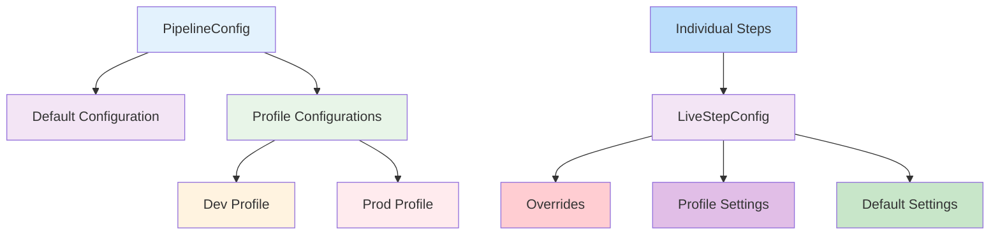

# Pipeline Configuration Guide

This document explains how to use the pipeline configuration system to manage both pipeline-level and step-level configurations.

## Overview

The configuration system consists of:

1. `PipelineConfig` - Manages pipeline-level configuration and profiles
2. `StepConfig` - Configuration for individual steps
3. `LiveStepConfig` - Dynamic configuration that combines pipeline defaults with step overrides
4. `ConfigurableStepBase` - Base class for steps that use the configuration system

The configuration hierarchy works as follows:



## How to Configure Steps

### 1. Create a Configurable Step

Extend `ConfigurableStepBase` and inject `PipelineConfig`:

```java
@ApplicationScoped
public class MyStep extends ConfigurableStepBase implements StepOneToOne<Input, Output> {
    
    @Inject
    public MyStep(PipelineConfig pipelineConfig) {
        super(pipelineConfig);
    }
    
    @Override
    public Output apply(Input input) {
        // Your step logic here
        return output;
    }
}
```

### 2. Configure Pipeline Defaults

In your main application, configure the pipeline defaults:

```java
// Configure profiles
pipelineConfig.defaults().retryLimit(3).debug(false);
pipelineConfig.profile("dev", new StepConfig().retryLimit(1).debug(true));
pipelineConfig.profile("prod", new StepConfig().retryLimit(5).retryWait(Duration.ofSeconds(1)));
```

### 3. Override Step Configuration (Optional)

If you need step-specific overrides, you can access the live configuration:

```java
@ApplicationScoped
public class MyStep extends ConfigurableStepBase implements StepOneToOne<Input, Output> {
    
    @Inject
    public MyStep(PipelineConfig pipelineConfig) {
        super(pipelineConfig);
        // Apply step-specific overrides
        liveConfig().overrides().retryLimit(5);
    }
    
    // ...
}
```

## Configuration Properties

All steps inherit the following configuration properties from `StepConfig`:

- `retryLimit`: Number of retry attempts (default: 3)
- `retryWait`: Base delay between retries (default: 200ms)
- `concurrency`: Concurrent execution limit (default: 4)
- `debug`: Enable debug logging (default: false)
- `recoverOnFailure`: Attempt recovery on failure (default: false)
- `runWithVirtualThreads`: Use virtual threads (default: false)
- `useExponentialBackoff`: Use exponential backoff (default: false)
- `maxBackoff`: Maximum backoff duration (default: 30s)
- `jitter`: Add jitter to retry delays (default: false)

## Profile Management

The configuration system automatically detects the Quarkus profile and activates the corresponding configuration. You can also manually activate profiles:

```java
pipelineConfig.activate("dev");
```

## Hot Reload

Configuration changes are applied dynamically without restarting the application, thanks to the atomic references used in the configuration classes.